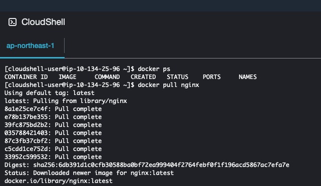
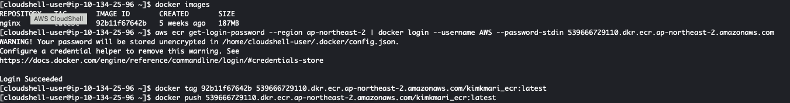

# CloudShell을 사용하여 Docker Image 업로드 하기
{: .no_toc }

## 목차
{: .no_toc .text-delta }

1. TOC
{:toc}

---

## 글을 쓴 배경

AWS CloudShell을 사용하여 Docker 이미지를 ECR Repository에 업로드하는 방법에 대해 설명합니다.

Mac으로 docker 이미지를 가져올 때 Linux 운영체제와 호환 문제를 피하기 위해 고민한 내용을 공유합니다.

## 글 요약

CloudShell을 활용하여 Docker Hub에서 이미지를 가져와 ECR에 업로드하는 방법입니다.

## 시작하기 전

이 튜토리얼은 특히 Mac 사용자에게 유용하며, AWS ECR 및 Docker에대한 기본적인 지식이 있는 분을 대상으로 작성되었습니다.

---

## 1. CloudShell 사용하기

CloudShell은 AWS 콘솔에서 리소스에 직접 액세스할 수 있는 셸을 제공합니다. Bash, PowerShell, Z shell과 같은 다양한 셸을 지원하며, 추가 다운로드나 설치 없이 AWS CLI 명령을 실행할 수 있습니다.

CloudShell을 시작하면 Amazon Linux 2023을 기반으로 하는 컴퓨팅 환경이 제공됩니다.

CloudShell 사용 시작하기: [Cloudshell 시작하기](https://docs.aws.amazon.com/ko_kr/cloudshell/latest/userguide/welcome.html#how-to-get-started)

## 2. CloudShell 에서의 Docker 지원

AWS CloudShell은 현재 13개 리전에서 Docker를 지원합니다.

자세히 알아보기: [AWS CloudShell, 이제 13개 리전에서 Docker 지원](https://aws.amazon.com/ko/about-aws/whats-new/2024/01/aws-cloudshell-docker-13-regions/)

## 3. CloudShell을 사용하여 Docker 이미지 업로드 단계

**Docker 이미지 가져오기:** 먼저 CloudShell 환경으로 dockerhub에서 nignx와 같은 sample Docker 이미지를 가져옵니다.

**ECR에 업로드:** 이미지가 CloudShell에 있으면, ECR 저장소에 업로드합니다.

