# ECS CLuster 구축 하기
{: .no_toc }

## 목차
{: .no_toc .text-delta }

1. TOC
{:toc}

---

# ECS

Amazon Elastic Container Service(Amazon ECS)는 완전관리형 컨테이너 오케스트레이션 서비스입니다.

다른 AWS 서비스와 통합을 통해 ECS에 새로운 기능을 추가할 수도 있습니다.

ECS는 EC2 뿐만아니라 AWS Fargate를 지원하여 컨테이너에 적합한 서버리스 컴퓨팅 환경을 제공합니다.

{: .no_toc }

## 목차
{: .no_toc .text-delta }

1. TOC
{:toc}

---

## 글을 쓴 배경

ECS 서비스를 이용해 sample application 도커 이미지를 배포하는 방법을 공유합니다.

## 글 요약


## 시작하기 전

참고자료 [AWS ECS Workshop](https://catalog.us-east-1.prod.workshops.aws/workshops/8c9036a7-7564-434c-b558-3588754e21f5/ko-KR/02-setup/01-atevent)

---

## 1. AWS ECR 레포지토리 생성

Amazon Elastic Container Registry(ECR)에 Amazon ECS에서 실행되는 애플리케이션 이미지를 저장, 실행 및 관리할 수 있습니다. 

ECS TaskDefinition에 Amazon ECR 리포지토리를 지정하기만 하면 Amazon ECS에서 애플리케이션에 적합한 이미지를 가져옵니다.

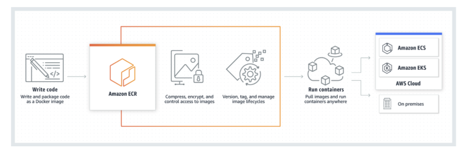

생성 후 배포할 이미지를 업로드 해줍니다. 저는 nginx container 이미지를 업로드해주었습니다.

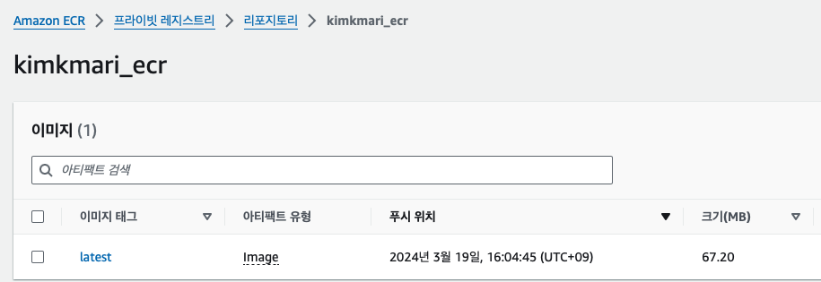

참고자료 : [Amazon ECR](https://catalog.us-east-1.prod.workshops.aws/workshops/8c9036a7-7564-434c-b558-3588754e21f5/ko-KR/03-console/03-ecr)

## 2. AWS ECS Cluster 생성

### 2.1 ECS 배포 방식 선정

ECS는 다음 두 가지 배포 방식을 제공합니다. 본 블로그에서는 EC2 방식을 선택하여 ECS 서비스를 배포합니다.

| 구분 | EC2 | Fargate |
|------|-----|---------|
| **관리 유형** | 사용자 관리 | AWS 관리 (서버리스) |
| **적합한 사용 사례** | - 규정 준수 필요한 워크로드 <br> - 사용자 정의 환경 필요한 워크로드 <br> - 고정 비용 구조 선호 | - 마이크로서비스 아키텍처 <br> - 이벤트 기반 컴퓨팅 |
| **장점** | - 다양한 인스턴스 유형 중 최적 선택 가능 <br> - 세밀한 리소스 설정 가능 <br> - 규정 준수 및 보안 커스터마이징 | - 인프라 관리 불필요, 개발에 집중 <br> - 자동 스케일링 및 운영 용이 |
| **단점** | - 인스턴스 관리 및 보안 업데이트 필요 <br> - 모니터링 및 장애 대응 필요 | - 특정 인스턴스 유형 선택 불가 <br> - 일부 고급 기능 사용 제한 (예: GPU, EBS) |
| **비용** | - 인스턴스 비용 기준 <br> - 예약 인스턴스로 비용 절감 가능 | - 사용량(CPU/MEM) 기준 청구 <br> - 일반적으로 EC2 대비 비용 높음 |
| **선택 포인트** | - 세밀한 컨트롤 및 규정 준수 요구 사항이 있는 경우 <br> - 장기적 비용 최적화 원하는 경우 | - 인프라 관리 부담 없이 개발에 집중하고자 하는 경우 <br> - 빠른 배포 및 자동 스케일링이 중요한 경우 |

### 2.2 ECS 클러스터 생성

#### 2.3.1 vpc 네트워크 인프라 구축

본 블로그에서는 AWS에서 제공하는 default VPC를 사용합니다.

혹은 [workshop에서 제공하는 cloudformation](https://catalog.us-east-1.prod.workshops.aws/workshops/8c9036a7-7564-434c-b558-3588754e21f5/ko-KR/02-setup/02-createaccount/01-stackdeploy)을 사용하거나, 사용자 정의 VPC를 구성할 수 있습니다.

#### 2.3.2 보안 그룹 설정

ALB 보안 그룹: 80, 443 포트를 열어줍니다.

EC2 인스턴스 보안 그룹: ALB로부터 오는 모든 트래픽을 허용합니다.

#### 2.3.3 IAM 역할 만들기

엔터티 유형 선택: AWS 서비스 -> EC2

정책 추가: AmazonEC2ContainerServiceforEC2Role, AmazonSSMManagedInstanceCore

추가 권한: 필요한 경우, 예를 들어 S3 접근 권한, 추가 정책을 포함합니다.

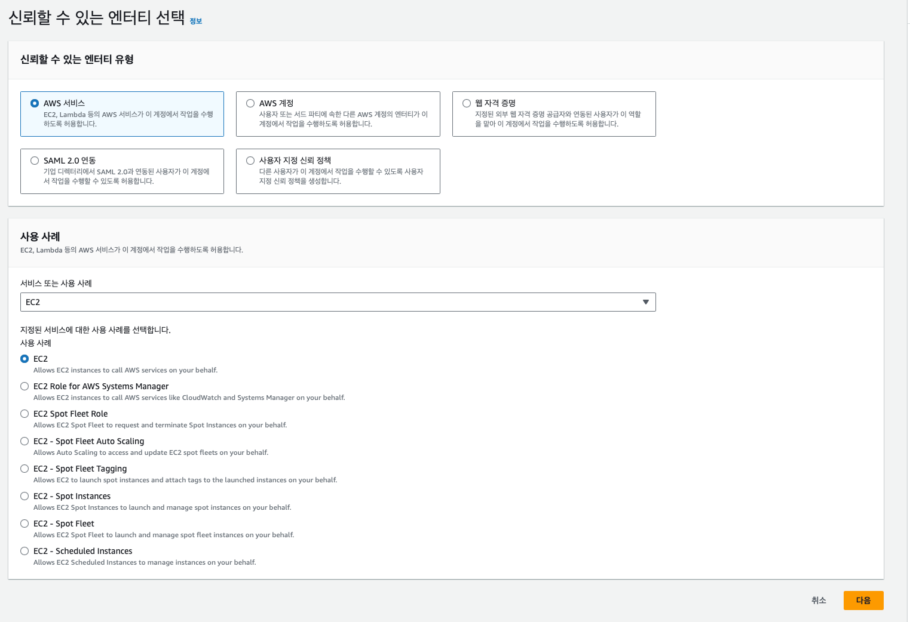

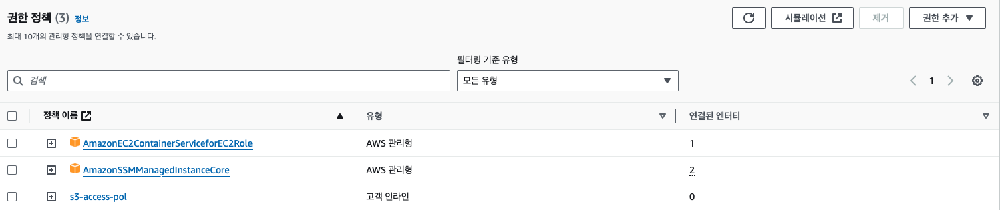


s3 접근 권한 정책 추가 예시 json 파일입니다.
```json
{
	"Version": "2012-10-17",
	"Statement": [
		{
			"Effect": "Allow",
			"Action": "s3:ListAllMyBuckets",
			"Resource": "*"
		},
		{
			"Sid": "ListObjectsInBucket",
			"Effect": "Allow",
			"Action": [
				"s3:ListBucket"
			],
			"Resource": [
				"arn:aws:s3:::s3-an2-prd-instance-bucket",
				"arn:aws:s3:::s3-an2-prd-instance-bucket/*"
			]
		},
		{
			"Sid": "AllObjectActions",
			"Effect": "Allow",
			"Action": "s3:*Object*",
			"Resource": [
				"arn:aws:s3:::s3-an2-prd-instance-bucket",
				"arn:aws:s3:::s3-an2-prd-instance-bucket/*"
			]
		}
	]
}
```

### 2.3 ECS 클러스터 구성하기

#### 2.3.1 인프라

Auto Scaling 그룹 생성: Amazon Linux 2 운영 체제를 선택합니다.

EC2 인스턴스 역할: 앞서 생성한 EC2용 IAM 역할을 지정합니다.

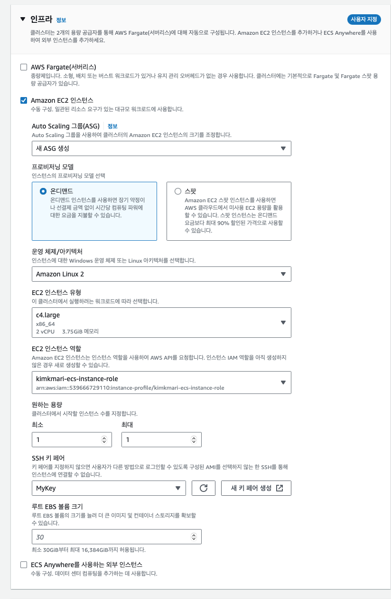

#### 2.3.2 Amazon EC2 인스턴스의 네트워크 설정

Subnet과 VPC 선택: 인스턴스가 위치할 네트워크를 지정합니다.

보안 그룹 지정: EC2 인스턴스용 보안 그룹을 선택합니다. 앞서 생성한 보안그룹을 선택해 줍니다.

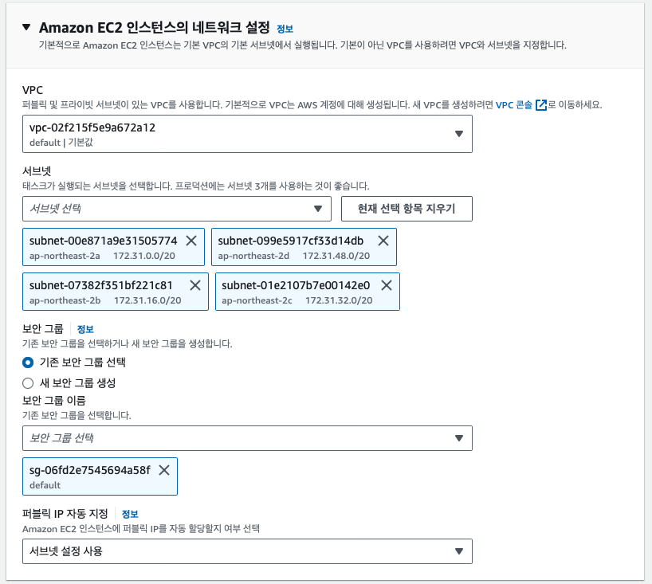

#### 2.3.3 생성된 Auto Scaling Group 확인하기

ECS 클러스터 생성 시 자동으로 생성된 Auto Scaling Group을 확인합니다.

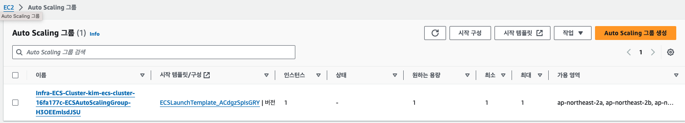

Auto Scaling Group에 연결된 Launch Template을 수정하여 EC2 인스턴스의 용량이나 다른 설정을 컨트롤 할 수 있습니다.

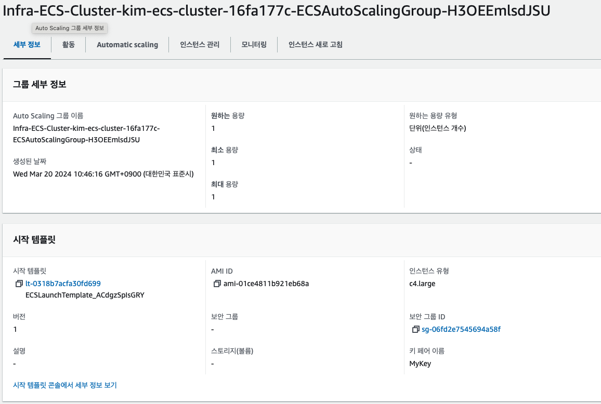

Launch template 을 수정하여 용량을 변경해보겠습니다. 템플릿 관리를 유연하게 하기위해 네트워크 설정은 포함되지 않게 합니다.

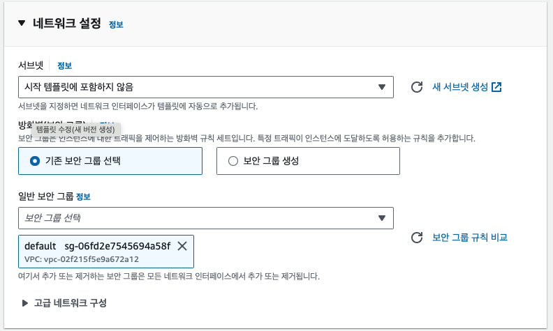

launch template을 수정했다면 시작 템플릿 편집을 클릭하여 버전을 2 혹은 latest로 수정합니다.

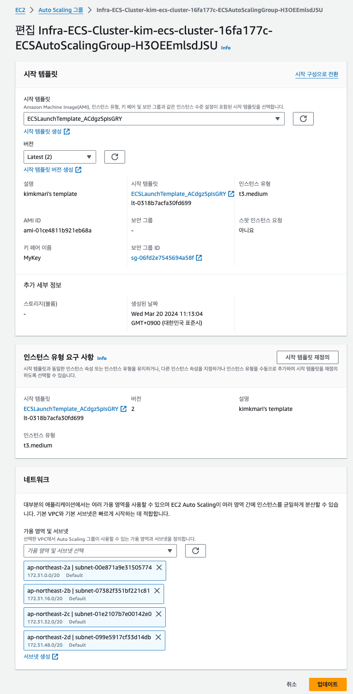

템플릿 버전을 적용하기 위해 새로고침을 해줍니다.

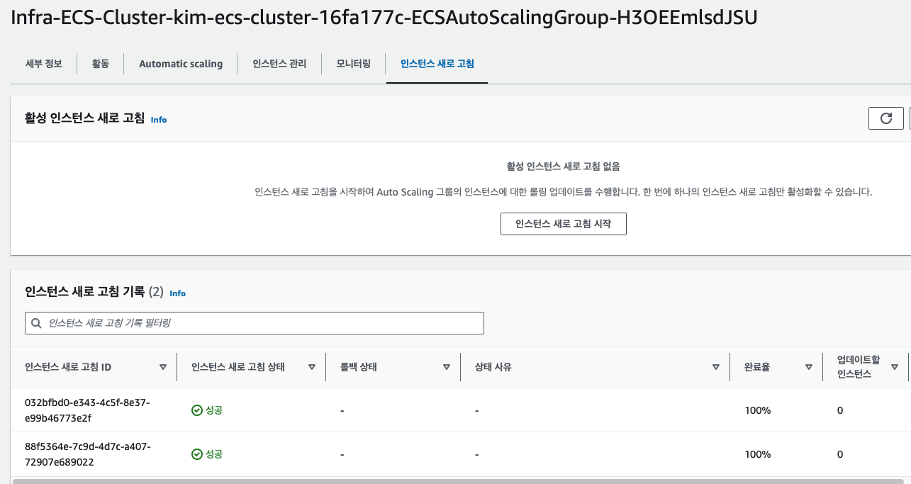

참고 자료 : [Launch Template 수정하기](https://catalog.us-east-1.prod.workshops.aws/workshops/8c9036a7-7564-434c-b558-3588754e21f5/ko-KR/03-console/04-ecs/01-cluster/asg)

### 2.4 ECS TaskDefinition 생성

어플리케이션을 ecs에 배포할 명세서 역할을 하는 태스크 정의를 생성해봅니다.

#### 2.4.1 인프라 요구 사항


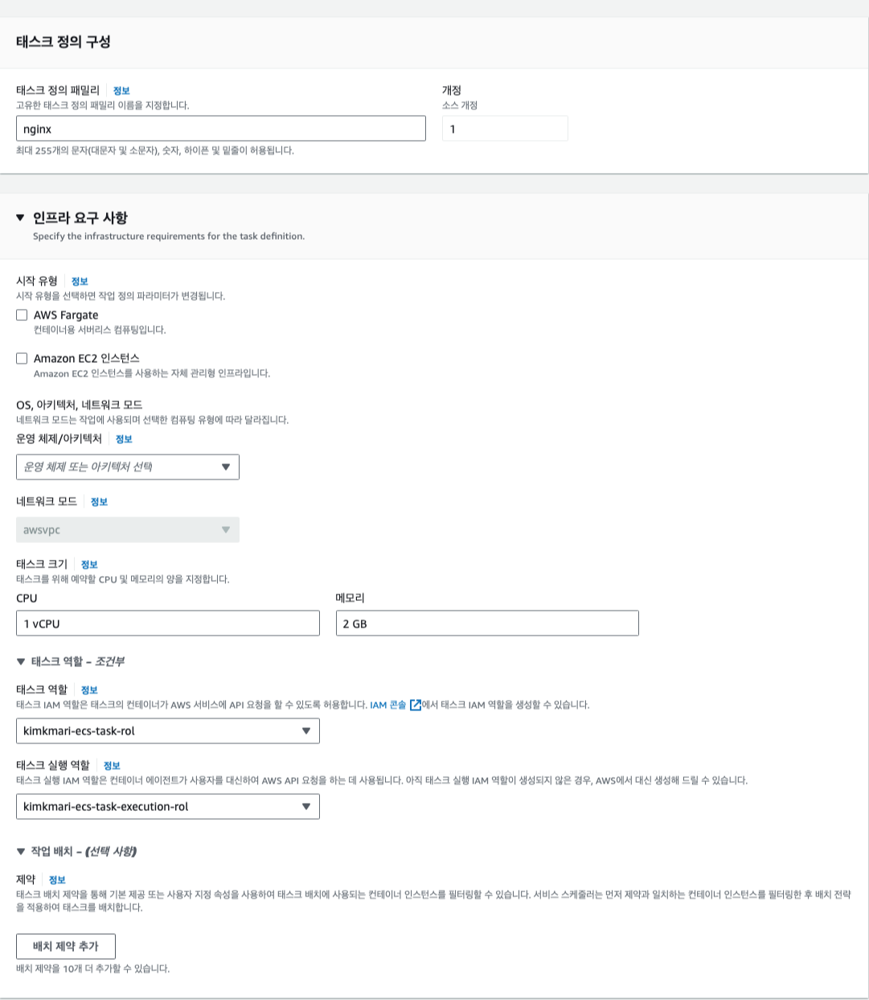

#### 컨테이너 - 1

태크스 역할 생성


### 2.3 ECS IAM 역할 수정

### 2.3 ALB 생성 후 TaskDefinition 기반으로 어플리케이션 배포