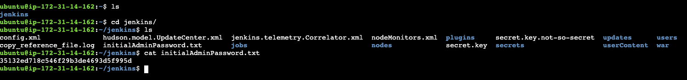
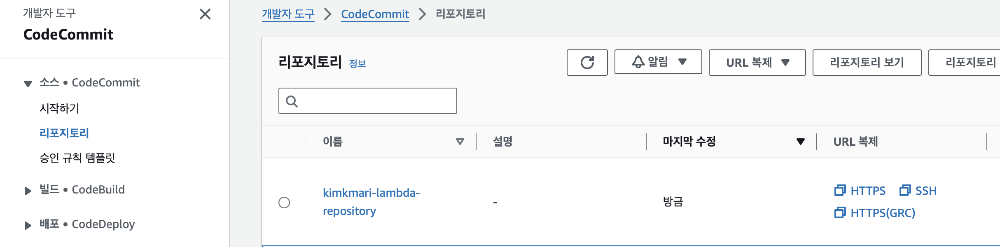
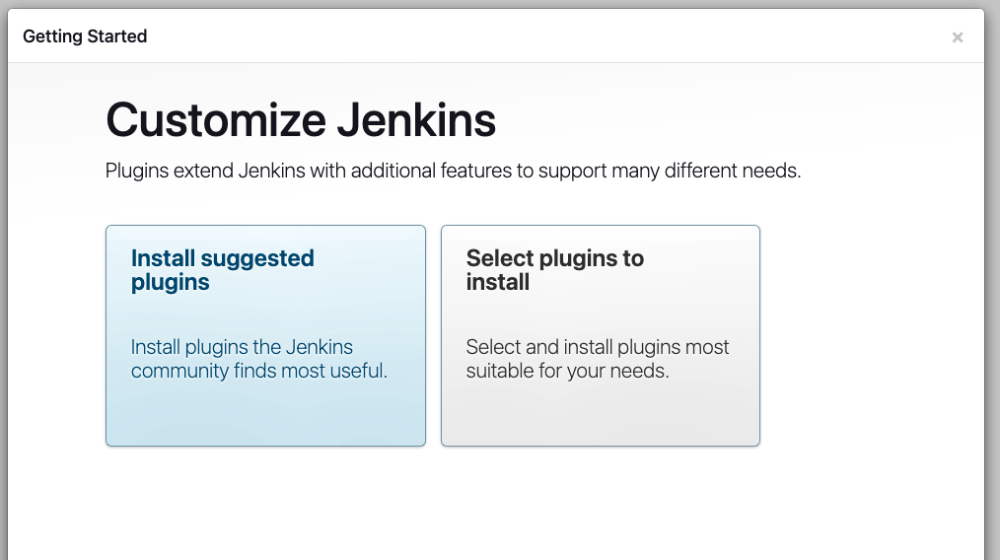
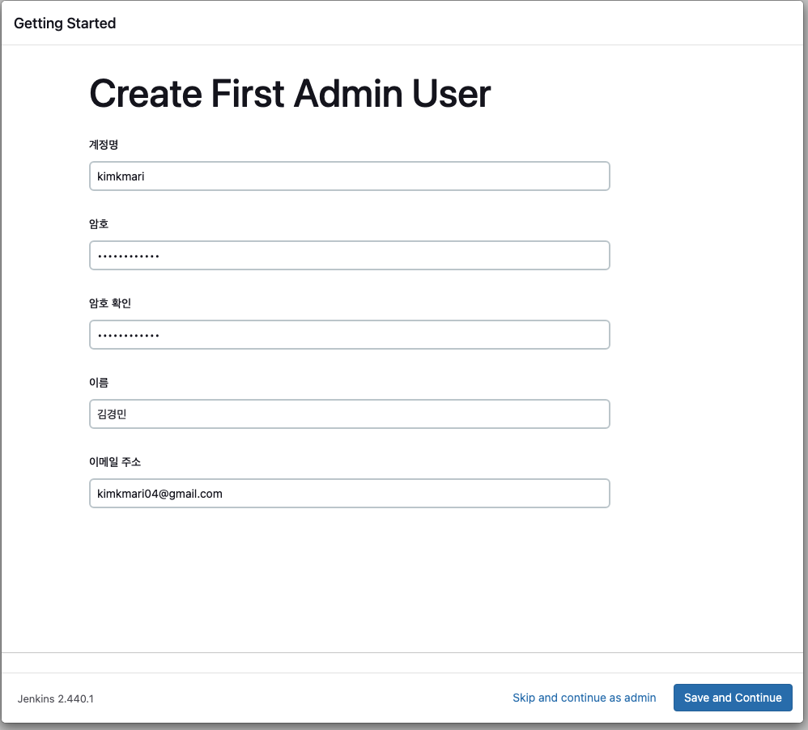

# AWS CodePipeline을 이용해 SAM으로 Lambda 배포하기


{: .no_toc }

## 목차
{: .no_toc .text-delta }

1. TOC
{:toc}

---

## 글을 쓴 배경

Lambda를 코드 레포지토리에서 관리하고 배포 자동화하는 과정을 공유하기 위해 작성되었습니다. 

## 글 요약
AWS CodeCommit에 lambda 및 파이프라인 구성 소스를 이용해 배포준비를 합니다.
codecommit - codebuild 과정에서 codebuild에서 sam을 이용해 lambda를 배포합니다. 람다 코드를 소스코드 저장소에서 관리할 수 있도록 합니다.

## 시작하기 전

AWS Code Series에 대한 기본적인 지식이 있는 분을 대상으로 합니다.

사용한 레포지토리 주소 Jenkins-repo

---

## 1. AWS EC2 Ubuntu OS를 awscli를 통해 배포

EC2 인스턴스 생성시, userdata 스크립트를 포함하여 인스턴스가 시작될 때 userdata에 정의된 command를 자동으로 수행하도록 합니다.

awscli를 이용하여 배포합니다.

보안그룹은 웹 서버에 필요한 80(HTTP) 포트와 443(HTTPS) 포트를 열어 외부의 접근을 허용합니다.

### awscli를 활용한 EC2 Ubuntu OS 배포
```shell
aws ec2 run-instances \
  --image-id ${UBUNTU_AMI_ID} \
  --count 1 \
  --instance-type t3.large \
  --key-name ${KEY_NAME} \
  --iam-instance-profile Name=${INSTANCE_PROFILE_ROLE} \
  --subnet-id ${SUBNET_ID} \
  --security-group-ids ${JENKINS_SG} \
  --tag-specifications 'ResourceType=instance,Tags=[{Key=Name,Value=jenkins-aws-cli-generate}]' \
  --block-device-mappings 'DeviceName=/dev/sda1,Ebs={VolumeSize=100}' \
  --user-data file://userdata.txt
``` 

## 2. userdata를 이용한 Jenkins 배포 자동화

### 2.1 userdata.txt

아래 스크립트는 EC2 인스턴스 생성 시 실행되며 Jenkins을 설치하기 위한 환경을 구축합니다. 
Jenkins 디렉토리 생성, Docker 설치 및 설정, Jenkins Docker 컨테이너 실행 등으로 구성되었습니다.

```shell
#!/bin/bash

# 사용자 변수 설정
USER_NAME=ubuntu

# Jenkins 디렉토리 생성 및 디렉토리 소유권변경
mkdir -p /home/ubuntu/jenkins/jenkins_home
chown -R ubuntu:ubuntu /home/ubuntu/jenkins

# Docker 설치
echo "1. [docker program installation] start"
apt-get update -y
curl -fsSL https://get.docker.com -o get-docker.sh
sh get-docker.sh
usermod -aG docker ${USER_NAME}

# Docker 서비스 활성화 및 시작
systemctl enable docker
systemctl start docker

# Jenkins Docker 컨테이너 실행
docker run -d -p 80:8080 -p 50000:50000 \
  --name jenkins \
  -v /home/ubuntu/jenkins/jenkins_home:/var/jenkins_home \
  jenkins/jenkins:jdk17

# Jenkins 초기 관리자 비밀번호 저장
echo "Waiting for Jenkins to initialize..."
sleep 30 # Jenkins 초기화를 기다림
docker exec jenkins cat /var/jenkins_home/secrets/initialAdminPassword > /home/ubuntu/jenkins/initialAdminPassword.txt
chown ubuntu:ubuntu /home/ubuntu/jenkins/initialAdminPassword.txt
```

### 2.2 userdata.txt 상세 설명

**사용자 변수 지정**
* Jenkins과 Docker를 실행할 사용자 이름을 설정합니다.
```bash
USER_NAME=ubuntu
 ```

**Jenkins 디렉토리 생성 및 디렉토리 소유권변경**
```bash
mkdir -p /home/ubuntu/jenkins/jenkins_home
chown -R ubuntu:ubuntu /home/ubuntu/jenkins
 ```

**Docker 설치**
* 공식 Docker 설치 스크립트를 다운받아 실행합니다. 설정한 USER_NAME에 해당하는 사용자를 Docker 그룹에 추가합니다.
* 기본적으로 도커 실행 권한은 root에만 있습니다. ${USER_NAME} 사용자를 Docker 그룹에 추가하여, sudo 없이 Docker 명령을 실행할 수 있도록 합니다.

```bash
echo "1. [docker program installation] start"
apt-get update -y
curl -fsSL https://get.docker.com -o get-docker.sh
sh get-docker.sh
usermod -aG docker ${USER_NAME}
 ```

**Docker 서비스 활성화 및 시작**
```bash
systemctl enable docker
systemctl start docker
```

**Jenkins Docker 컨테이너 실행**
  * -d 컨테이너 백그라운드 실행
  * -p 8080:8080 젠킨슨은 기본적으로 8080 포트에서 웹 인터페이스를 제공합니다. 호스트 포트를 변경하여 외부에서 Jenkins 웹 인터페이스에 접근하는 포트를 변경할 수 있습니다.
  * -p 50000:50000 젠킨슨 에이전트가 실행되기 위한 포트도 컨테이너에 연결해 줍니다.
  * --name 컨테이너 이름을 지정합니다.
  * -v Jenkins 데이터를 호스트 서버에 마운트하기 위한 설정입니다. Jenkins 설정 및 빌드데이터가 컨테이너 재시작 후에도 유지됩니다.

```bash
# Jenkins Docker 컨테이너 실행
docker run -d -p 8080:8080 -p 50000:50000 \
  --name jenkins \
  -v /home/ubuntu/jenkins/jenkins_home:/var/jenkins_home \
  jenkins/jenkins:jdk17
  ```

**Jenkins 초기 관리자 비밀번호 저장**
* 컨테이너 내부에 있는 var/jenkins_home/secrets 디렉토리내에 있는 비밀번호를 확인합니다.
* 
```shell
echo "Waiting for Jenkins to initialize..."
sleep 30 # Jenkins 초기화를 기다림
docker exec jenkins cat /var/jenkins_home/secrets/initialAdminPassword > /home/ubuntu/jenkins/initialAdminPassword.txt
chown ubuntu:ubuntu /home/ubuntu/jenkins/initialAdminPassword.txt
```

## jenkins 접속하기

http://<호스트의 IP 주소 또는 도메인>:8080 에 접속합니다.

서버에 접속한 후 Administrator password를 확인합니다. /home/ubuntu/jenkins/initialAdminPassword.txt 해당 경로에서 확인 가능합니다.




컨테이너를 배포할 때 확인했던 비밀번호를 입력해줍니다.



install suggested plugins를 클릭하고 젠킨슨을 설치해줍니다.



* 이미 jenkins/jenkins:jdk17을 이용해서 젠킨슨을 설치했기 때문에
**Oracle Java SE Development Kit Installer** 해당 플러그인은 삭제하여도 무방합니다.

접속 성공


## 별첨

**설치된 플러그인에대한 간략한 설명**

**Pipeline: REST API:** 파이프라인 상태, 결과 등을 조회할 수 있습니다.

**Pipeline: Stage View:** 파이프라인의 각 스테이지를 시각적으로 표현해주는 UI를 제공합니다.

**Oracle Java SE Development Kit Installer**: Oracle의 웹사이트에서 Java SE Development Kit(JDK)를 다운로드하여 설치할 수 있게 해주는 플러그인입니다.

**Command Agent Launcher**: 지정된 명령어를 사용하여 에이전트를 실행할 수 있게 해주는 에이전트 관리 플러그인입니다.

**SSH server**: Jenkins에 SSH 서버 기능을 추가하여, CLI 명령을 통해 Jenkins를 원격으로 조작할 수 있게 해주는 플러그인입니다.

**Authentication Tokens API**: 자격증명을 인증 토큰으로 변환하는 API를 제공합니다. Jenkins에서 보다 안전한 인증 방법을 구현할 때 사용됩니다.

**Docker Pipeline**: Jenkins 파이프라인에서 Docker 컨테이너를 빌드하고 사용할 수 있게 해주는 플러그인입니다.

**Lockable Resources**: 복수의 작업이 동일한 외부 자원에 의존하는 복잡한 CI/CD 파이프라인을 구성할 때 유용합니다. 이 플러그인을 사용함으로써 자원 충돌을 방지하고, 빌드 프로세스의 안정성과 효율성을 높일 수 있습니다.

**Role-based Authorization Strategy**: 사용자 권한을 역할 기반으로 관리할 수 있게 해주는 보안 플러그인입니다.

**JSch dependency**: SSH 연결을 위한 Java 라이브러리인 JSch를 Jenkins 플러그인으로 제공합니다.

**Maven Integration**: Maven 프로젝트와 Jenkins 사이의 통합을 제공합니다.

**Docker Commons**: 다양한 Docker 관련 플러그인에서 사용할 수 있는 공통 기능을 제공합니다.

**HTML Publisher**: 빌드 후 생성된 HTML 보고서를 Jenkins에서 직접 볼 수 있게 해주는 플러그인입니다.

**Role-based Authorization Strategy**: 사용자와 그룹에 역할 기반의 접근 제어를 허용하는 보안 플러그인입니다.

**Subversion**: Jenkins에서 Apache Subversion 지원을 추가합니다. SVNKit을 통해 Subversion 저장소와의 상호 작용을 가능하게 합니다.

**Favorite**: 사용자가 특정 작업을 '즐겨찾기'로 설정할 수 있게 해주는 플러그인입니다.

**Parameterized Trigger**: 한 빌드가 완료된 후 다양한 방법으로 새 빌드를 트리거할 수 있게 해주는 플러그인입니다. 새 빌드에 파라미터를 전달하는 것도 가능합니다.

**Bitbucket Branch Source**: Bitbucket Cloud 및 Bitbucket Server를 사용하여 프로젝트의 소스로 활용할 수 있게 해주는 플러그인입니다.

**Blue Ocean:** 이들 모두 Blue Ocean UI와 관련된 플러그인으로, Jenkins의 사용자 경험을 현대화하고, 파이프라인 관리 및 시각화를 향상시키기 위해 설계되었습니다.

**DataTables.net API:** jQuery DataTables를 Jenkins 플러그인에 제공합니다. 이를 통해 HTML 테이블에 고급 기능을 쉽게 추가할 수 있습니다.

## FAQ

Q: 설치된 젠킨슨에서 플러그인을 재대로 다운받지 못하면 어떻게 해야 하나요?

A: 보안 그룹 설정에 플러그인을 다운받기위한 HTTP, HTTPS 포트가 열려 있는지 확인합니다.