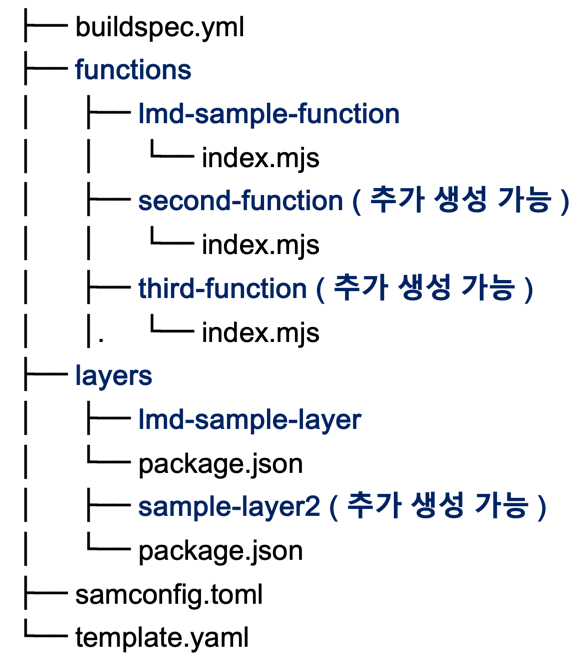
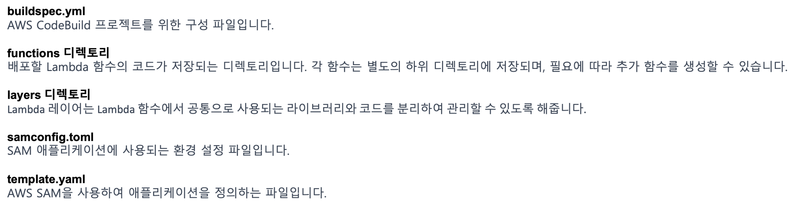

# AWS CodePipeline을 이용해 SAM으로 Lambda 배포하기

AWS의 Lambda 함수 배포 과정을 자동화하는 방법을 소개합니다. 
AWS CodePipeline과 SAM(Serverless Application Model)을 활용해 
코드의 변경이 있을 때 자동으로 배포 프로세스가 실행되도록 하는 방법을 공유합니다.


{: .no_toc }

## 목차
{: .no_toc .text-delta }

1. TOC
{:toc}
---

## 글을 쓴 배경

코드 레포지토리에서 Lambda 함수를 관리하고, 배포 과정을 자동화하는 방법을 고민하던 중 작성되었습니다.

## 글 요약

AWS CodePipeline은 소스 스테이지로 지정된 AWS CodeCommit의 소스 변경 사항을 감지하고,

CodeBuild를 빌드 스테이지를 사용하여 SAM을 통해 Lambda 함수를 배포하는 과정을 소개합니다.

Lambda 함수 코드와 관련 파이프라인 구성 파일은 모두 AWS CodeCommit 레포지토리에 저장되어 관리됩니다.


**AWS CodePipeline** : AWS에서 제공하는 통합 CI/CD 서비스 입니다. 코드의 변경 사항을 자동으로 배포할 수 있습니다.

**AWS SAM** : AWS 서버리스 애플리케이션을 구축 및 배포를 돕는 프레임워크입니다. SAM은 배포 시 AWS CloudFormation 템플릿으로 변환되어, Lambda, API Gateway, DynamoDB 등 AWS 서버리스 서비스의 구성을 관리할 수 있습니다.

## 시작하기 전

AWS Code Series 및 AWS Lambda, SAM에 대한 기본 지식이 필요합니다.

사용한 레포지토리 주소 Jenkins-repo

---

## 1. AWS CodeCommit Repository 구성

소스 코드 저장소로 AWS CodeCommit을 사용합니다. 
CodeCommit은 AWS에서 제공하는 GIT 형상 관리 서비스로, 프라이빗 레포지토리를 제공합니다.


### 1.1 전체 소스코드 구조

| 실제 프로젝트 파일 구조 | 파일 및 디렉토리 구조 설명 |
|-|-|
|||


### 2. buildspec.yml 구성

`buildspec.yml`은 CodeBuild 프로젝트 구성파일입니다.

```yaml
version: 0.2

env:
  shell: bash

phases:
  install:
    runtime-versions:
      nodejs: 20
    commands:
  build:
    commands:
      - echo Build started on `date`
      - ls -alh ./
      - sam build
      - sam deploy --no-confirm-changeset --no-progressbar --no-fail-on-empty-changeset
```

#### 2.1 buildspec.yml 상세설명

**2.1.1 `sam build`**

template.yaml 파일에 정의된 AWS 서버리스 애플리케이션의 빌드 작업을 수행합니다.

SAM은 템플릿에 정의된 각 AWS 리소스(예: Lambda 함수)에 필요한 종속성을 설치하고, 이를 포함한 배포 패키지를 구성합니다.

Node.js를 예로 들면, npm install을 통해 필요한 라이브러리를 설치하는 것과 유사합니다.

**2.1.2 `sam deploy --no-confirm-changeset --no-progressbar --no-fail-on-empty-changeset`**

* `sam build`를 통해 생성된 배포 패키지를 AWS CloudFormation 스택으로 배포합니다. 여러 하위 옵션들과 함께 사용될 수 있습니다.

* `--no-confirm-changeset`: SAM이 AWS CloudFormation이 리소스를 생성 혹은 업데이트할 때 사용자의 확인 절차 없이 바로 진행합니다.

* `--no-progressbar`: 배포 프로세스 progress bar을 표시하지 않도록 합니다.

* `--no-fail-on-empty-changeset`: 만약 변경 사항이 없는 경우에도 배포 프로세스가 실패하지 않도록 합니다.

```bash
  - sam build
  - sam deploy --no-confirm-changeset --no-progressbar --no-fail-on-empty-changeset
 ```

### 3. samconfig.toml 구성

samconfig.toml 파일은 AWS SAM 배포와 관련된 구성 옵션을 정의합니다. 이 파일을 통해 SAM 명령어의 기본 설정값을 사전에 지정할 수 있어, 명령어 실행 시 매번 옵션을 입력할 필요가 없게 됩니다.

기본 구성
version: 파일 형식의 버전을 명시합니다.
[default.global.parameters]: 모든 SAM 명령에 적용되는 전역 설정을 정의합니다.
stack_name: 기본적으로 사용될 AWS CloudFormation 스택의 이름을 설정합니다.
배포 설정 [default.deploy.parameters]
stack_name: 배포할 때 사용될 CloudFormation 스택의 이름입니다.
s3_bucket: SAM 패키지를 업로드할 Amazon S3 버킷의 이름입니다.
s3_prefix: S3 버킷 내에서 SAM 패키지를 저장할 경로(프리픽스)입니다.
region: 배포 대상 AWS 리전을 지정합니다.
confirm_changeset: 배포 전 변경 세트를 확인할지 여부를 결정합니다. (true 설정 시 확인 절차 필요)
capabilities: CloudFormation 스택 생성 시 필요한 권한을 명시합니다. (CAPABILITY_IAM은 IAM 리소스 생성 권한을 부여)
빌드 설정 [default.build.parameters]
no_beta_features: 베타 기능의 사용 여부를 결정합니다. (true로 설정 시 베타 기능 비활성화)

```toml
version=0.1
[default.global.parameters]
stack_name = "common-stack"

[default.deploy.parameters]
stack_name = "stack-lambda"
s3_bucket = "cnp-kkm-s3"
s3_prefix = ""
region = "ap-northeast-2"
confirm_changeset = true
capabilities = "CAPABILITY_IAM"

[default.build.parameters]
no_beta_features = true
```


### awscli를 활용한 EC2 Ubuntu OS 배포
```shell
aws ec2 run-instances \
  --image-id ${UBUNTU_AMI_ID} \
  --count 1 \
  --instance-type t3.large \
  --key-name ${KEY_NAME} \
  --iam-instance-profile Name=${INSTANCE_PROFILE_ROLE} \
  --subnet-id ${SUBNET_ID} \
  --security-group-ids ${JENKINS_SG} \
  --tag-specifications 'ResourceType=instance,Tags=[{Key=Name,Value=jenkins-aws-cli-generate}]' \
  --block-device-mappings 'DeviceName=/dev/sda1,Ebs={VolumeSize=100}' \
  --user-data file://userdata.txt
``` 

## 2. userdata를 이용한 Jenkins 배포 자동화

### 2.1 userdata.txt

아래 스크립트는 EC2 인스턴스 생성 시 실행되며 Jenkins을 설치하기 위한 환경을 구축합니다. 
Jenkins 디렉토리 생성, Docker 설치 및 설정, Jenkins Docker 컨테이너 실행 등으로 구성되었습니다.

```shell
#!/bin/bash

# 사용자 변수 설정
USER_NAME=ubuntu

# Jenkins 디렉토리 생성 및 디렉토리 소유권변경
mkdir -p /home/ubuntu/jenkins/jenkins_home
chown -R ubuntu:ubuntu /home/ubuntu/jenkins

# Docker 설치
echo "1. [docker program installation] start"
apt-get update -y
curl -fsSL https://get.docker.com -o get-docker.sh
sh get-docker.sh
usermod -aG docker ${USER_NAME}

# Docker 서비스 활성화 및 시작
systemctl enable docker
systemctl start docker

# Jenkins Docker 컨테이너 실행
docker run -d -p 80:8080 -p 50000:50000 \
  --name jenkins \
  -v /home/ubuntu/jenkins/jenkins_home:/var/jenkins_home \
  jenkins/jenkins:jdk17

# Jenkins 초기 관리자 비밀번호 저장
echo "Waiting for Jenkins to initialize..."
sleep 30 # Jenkins 초기화를 기다림
docker exec jenkins cat /var/jenkins_home/secrets/initialAdminPassword > /home/ubuntu/jenkins/initialAdminPassword.txt
chown ubuntu:ubuntu /home/ubuntu/jenkins/initialAdminPassword.txt
```

### 2.2 userdata.txt 상세 설명

**사용자 변수 지정**
* Jenkins과 Docker를 실행할 사용자 이름을 설정합니다.
```bash
USER_NAME=ubuntu
 ```

**Jenkins 디렉토리 생성 및 디렉토리 소유권변경**
```bash
mkdir -p /home/ubuntu/jenkins/jenkins_home
chown -R ubuntu:ubuntu /home/ubuntu/jenkins
 ```

**Docker 설치**
* 공식 Docker 설치 스크립트를 다운받아 실행합니다. 설정한 USER_NAME에 해당하는 사용자를 Docker 그룹에 추가합니다.
* 기본적으로 도커 실행 권한은 root에만 있습니다. ${USER_NAME} 사용자를 Docker 그룹에 추가하여, sudo 없이 Docker 명령을 실행할 수 있도록 합니다.

```bash
echo "1. [docker program installation] start"
apt-get update -y
curl -fsSL https://get.docker.com -o get-docker.sh
sh get-docker.sh
usermod -aG docker ${USER_NAME}
 ```

**Docker 서비스 활성화 및 시작**
```bash
systemctl enable docker
systemctl start docker
```

**Jenkins Docker 컨테이너 실행**
  * -d 컨테이너 백그라운드 실행
  * -p 8080:8080 젠킨슨은 기본적으로 8080 포트에서 웹 인터페이스를 제공합니다. 호스트 포트를 변경하여 외부에서 Jenkins 웹 인터페이스에 접근하는 포트를 변경할 수 있습니다.
  * -p 50000:50000 젠킨슨 에이전트가 실행되기 위한 포트도 컨테이너에 연결해 줍니다.
  * --name 컨테이너 이름을 지정합니다.
  * -v Jenkins 데이터를 호스트 서버에 마운트하기 위한 설정입니다. Jenkins 설정 및 빌드데이터가 컨테이너 재시작 후에도 유지됩니다.

```bash
# Jenkins Docker 컨테이너 실행
docker run -d -p 8080:8080 -p 50000:50000 \
  --name jenkins \
  -v /home/ubuntu/jenkins/jenkins_home:/var/jenkins_home \
  jenkins/jenkins:jdk17
  ```

**Jenkins 초기 관리자 비밀번호 저장**
* 컨테이너 내부에 있는 var/jenkins_home/secrets 디렉토리내에 있는 비밀번호를 확인합니다.
* 
```shell
echo "Waiting for Jenkins to initialize..."
sleep 30 # Jenkins 초기화를 기다림
docker exec jenkins cat /var/jenkins_home/secrets/initialAdminPassword > /home/ubuntu/jenkins/initialAdminPassword.txt
chown ubuntu:ubuntu /home/ubuntu/jenkins/initialAdminPassword.txt
```

## jenkins 접속하기

http://<호스트의 IP 주소 또는 도메인>:8080 에 접속합니다.

서버에 접속한 후 Administrator password를 확인합니다. /home/ubuntu/jenkins/initialAdminPassword.txt 해당 경로에서 확인 가능합니다.


컨테이너를 배포할 때 확인했던 비밀번호를 입력해줍니다.


install suggested plugins를 클릭하고 젠킨슨을 설치해줍니다.


* 이미 jenkins/jenkins:jdk17을 이용해서 젠킨슨을 설치했기 때문에
**Oracle Java SE Development Kit Installer** 해당 플러그인은 삭제하여도 무방합니다.

접속 성공


## 별첨

**설치된 플러그인에대한 간략한 설명**

**Pipeline: REST API:** 파이프라인 상태, 결과 등을 조회할 수 있습니다.

**Pipeline: Stage View:** 파이프라인의 각 스테이지를 시각적으로 표현해주는 UI를 제공합니다.

**Oracle Java SE Development Kit Installer**: Oracle의 웹사이트에서 Java SE Development Kit(JDK)를 다운로드하여 설치할 수 있게 해주는 플러그인입니다.

**Command Agent Launcher**: 지정된 명령어를 사용하여 에이전트를 실행할 수 있게 해주는 에이전트 관리 플러그인입니다.

**SSH server**: Jenkins에 SSH 서버 기능을 추가하여, CLI 명령을 통해 Jenkins를 원격으로 조작할 수 있게 해주는 플러그인입니다.

**Authentication Tokens API**: 자격증명을 인증 토큰으로 변환하는 API를 제공합니다. Jenkins에서 보다 안전한 인증 방법을 구현할 때 사용됩니다.

**Docker Pipeline**: Jenkins 파이프라인에서 Docker 컨테이너를 빌드하고 사용할 수 있게 해주는 플러그인입니다.

**Lockable Resources**: 복수의 작업이 동일한 외부 자원에 의존하는 복잡한 CI/CD 파이프라인을 구성할 때 유용합니다. 이 플러그인을 사용함으로써 자원 충돌을 방지하고, 빌드 프로세스의 안정성과 효율성을 높일 수 있습니다.

**Role-based Authorization Strategy**: 사용자 권한을 역할 기반으로 관리할 수 있게 해주는 보안 플러그인입니다.

**JSch dependency**: SSH 연결을 위한 Java 라이브러리인 JSch를 Jenkins 플러그인으로 제공합니다.

**Maven Integration**: Maven 프로젝트와 Jenkins 사이의 통합을 제공합니다.

**Docker Commons**: 다양한 Docker 관련 플러그인에서 사용할 수 있는 공통 기능을 제공합니다.

**HTML Publisher**: 빌드 후 생성된 HTML 보고서를 Jenkins에서 직접 볼 수 있게 해주는 플러그인입니다.

**Role-based Authorization Strategy**: 사용자와 그룹에 역할 기반의 접근 제어를 허용하는 보안 플러그인입니다.

**Subversion**: Jenkins에서 Apache Subversion 지원을 추가합니다. SVNKit을 통해 Subversion 저장소와의 상호 작용을 가능하게 합니다.

**Favorite**: 사용자가 특정 작업을 '즐겨찾기'로 설정할 수 있게 해주는 플러그인입니다.

**Parameterized Trigger**: 한 빌드가 완료된 후 다양한 방법으로 새 빌드를 트리거할 수 있게 해주는 플러그인입니다. 새 빌드에 파라미터를 전달하는 것도 가능합니다.

**Bitbucket Branch Source**: Bitbucket Cloud 및 Bitbucket Server를 사용하여 프로젝트의 소스로 활용할 수 있게 해주는 플러그인입니다.

**Blue Ocean:** 이들 모두 Blue Ocean UI와 관련된 플러그인으로, Jenkins의 사용자 경험을 현대화하고, 파이프라인 관리 및 시각화를 향상시키기 위해 설계되었습니다.

**DataTables.net API:** jQuery DataTables를 Jenkins 플러그인에 제공합니다. 이를 통해 HTML 테이블에 고급 기능을 쉽게 추가할 수 있습니다.

## FAQ

Q: 설치된 젠킨슨에서 플러그인을 재대로 다운받지 못하면 어떻게 해야 하나요?

A: 보안 그룹 설정에 플러그인을 다운받기위한 HTTP, HTTPS 포트가 열려 있는지 확인합니다.