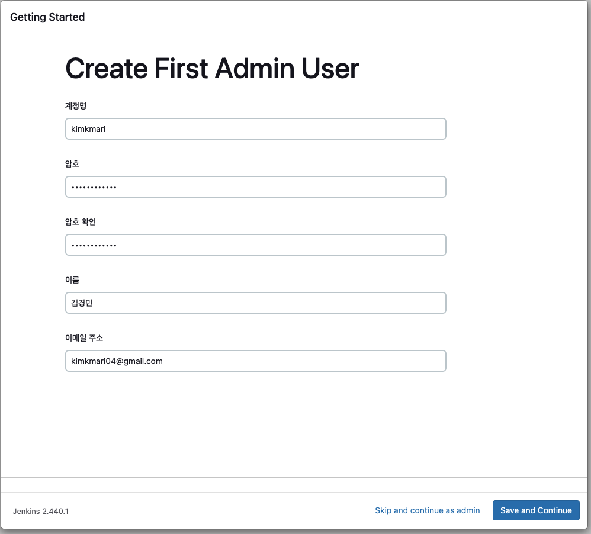

# AWS EC2에서 Docker를 사용하여 Jenkins 배포하기
{: .no_toc }


## 목차
{: .no_toc .text-delta }

1. TOC
{:toc}

---

## 글을 쓴 배경

Jenkins를 AWS EC2 인스턴스에 설치하는 과정을 기록하기 위해 작성하였습니다.

## 글 요약

AWS EC2 인스턴스 생성부터 Docker 이미지를 이용한 배포 프로세스까지 스크립트를 이용해 한번에 설치할 수 있도록 구성하였습니다.

## 시작하기 전

Jenkins와 AWS에 대한 기본적인 사용 경험을 가진 DevOps 엔지니어를 대상으로 합니다. 
AWS EC2 인스턴스 생성 및 설정에 대한 기본 지식이 필요합니다.
Docker에대한 기본지식이 필요합니다.

사용한 레포지토리 주소 Jenkins-repo

## EC2 인스턴스에 Jenkins Docker Image를 이용한 기본 배포

awscli 와 ec2 userdata를 이용하여 jenkins을 배포합니다.

### awscli를 활용한 EC2 배포
```shell
aws ec2 run-instances \
  --image-id ${UBUNTU_AMI_ID} \
  --count 1 \
  --instance-type t3.large \
  --key-name ${KEY_NAME} \
  --iam-instance-profile Name=${INSTANCE_PROFILE_ROLE} \
  --subnet-id ${SUBNET_ID} \
  --security-group-ids ${JENKINS_SG} \
  --tag-specifications 'ResourceType=instance,Tags=[{Key=Name,Value=jenkins-aws-cli-generate}]' \
  --block-device-mappings 'DeviceName=/dev/sda1,Ebs={VolumeSize=100}' \
  --user-data file://userdata.txt
``` 

### userdata를 이용한 Jenkins 자동배포

**userdata.txt**
```shell
#!/bin/bash

# 사용자 변수 설정
USER_NAME=ubuntu

mkdir -p /home/ubuntu/jenkins/jenkins_home
chown -R ubuntu:ubuntu /home/ubuntu/jenkins

# Docker 설치
echo "1. [docker program installation] start"
apt-get update -y
curl -fsSL https://get.docker.com -o get-docker.sh
sh get-docker.sh
usermod -aG docker ${USER_NAME}

# Docker 서비스 활성화 및 시작
systemctl enable docker
systemctl start docker

# Jenkins Docker 컨테이너 실행
docker run -d -p 80:8080 -p 50000:50000 \
  --name jenkins \
  -v /home/ubuntu/jenkins/jenkins_home:/var/jenkins_home \
  jenkins/jenkins:lts

# Jenkins 초기 관리자 비밀번호 저장
echo "Waiting for Jenkins to initialize..."
sleep 30 # Jenkins 초기화를 기다림
docker exec jenkins cat /var/jenkins_home/secrets/initialAdminPassword > /home/ubuntu/jenkins/initialAdminPassword.txt
chown ubuntu:ubuntu /home/ubuntu/jenkins/initialAdminPassword.txt

```

**userdata 상세 설명**

사용자 변수 지정
* Jenkins과 Docker를 실행할 사용자 이름을 설정합니다.
```bash
USER_NAME=ubuntu
 ```

Jenkins 디렉토리 생성 및 디렉토리 소유권변경
```bash
mkdir -p /home/ubuntu/jenkins/jenkins_home
chown -R ubuntu:ubuntu /home/ubuntu/jenkins
 ```

Docker 설치
* 공식 Docker 설치 스크립트를 다운받아 실행합니다. 설정한 USER_NAME에 해당하는 사용자를 Docker 그룹에 추가합니다.
* 기본적으로 도커 실행 권한은 root에만 있습니다. ${USER_NAME} 사용자를 Docker 그룹에 추가하여, sudo 없이 Docker 명령을 실행할 수 있도록 합니다.

```bash
echo "1. [docker program installation] start"
apt-get update -y
curl -fsSL https://get.docker.com -o get-docker.sh
sh get-docker.sh
usermod -aG docker ${USER_NAME}
 ```

Docker 서비스를 시스템 부팅 시 자동으로 시작하게 설정합니다.
```bash
systemctl enable docker
systemctl start docker
```

Jenkins를 Docker 컨테이너 실행
  * -d 컨테이너 백그라운드 실행
  * -p 8080:8080 젠킨슨은 기본적으로 8080 포트에서 웹 인터페이스를 제공합니다. 따라서 컨테이너의 포트를 호스트 포트에 연결하기 위해 동일한 포트를 붙여줘야 합니다.
  * -p 50000:50000 젠킨슨 에이전트가 실행되기 위한 포트도 컨테이너에 연결해 줍니다.
  * --name 컨테이너 이름을 지정합니다.
  * -v 젠킨슨 컨테이너 볼륨을 마운트할 디렉토리 경로를 설정합니다.

```bash
# Jenkins Docker 컨테이너 실행
docker run -d -p 8080:8080 -p 50000:50000 \
  --name jenkins \
  -v /home/ubuntu/jenkins/jenkins_home:/var/jenkins_home \
  jenkins/jenkins:lts
  ```

Jenkins 초기 관리자 비밀번호 저장
* 컨테이너 내부에 있는 var/jenkins_home/secrets 디렉토리내에 있는 비밀번호를 확인합니다.
* 
```shell
echo "Waiting for Jenkins to initialize..."
sleep 30 # Jenkins 초기화를 기다림
docker exec jenkins cat /var/jenkins_home/secrets/initialAdminPassword > /home/ubuntu/jenkins/initialAdminPassword.txt
chown ubuntu:ubuntu /home/ubuntu/jenkins/initialAdminPassword.txt
```

### jenkins 접속하기

* 서버에 접속한 후 Administrator password를 가져와야 함
  
* 컨테이너를 배포할 때 확인했던 비밀번호를 입력해줍니다.


* install suggested plugins를 클릭하고 젠킨슨을 설치해줍니다.

* 접속 성공


