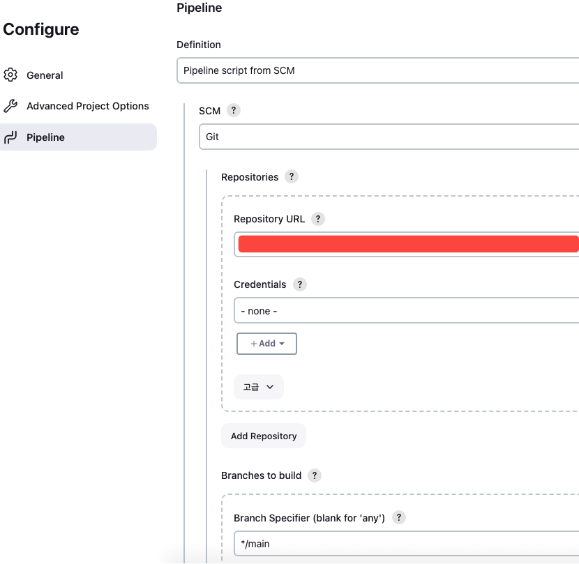

# jenkins pipeline에서 scm 사용하기

Jenkins 파이프라인에서 소스 코드 버전 관리(SCM) 시스템을 사용하는 법 가이드

{: .no_toc }


## 목차
{: .no_toc .text-delta }

1. TOC
{:toc}

---

## 글을 쓴 배경

하나의 Jenkins 파이프라인에서 두 개 이상의 리포지토리를 참조해야 할 필요성이 발생했습니다.

소스 코드와 CI/CD 관련 코드를 분리하여 관리하고 특정 태그값을 지정해 배포해 달라는 요청을 받았습니다.

## 글 요약


## 시작하기 전

Ubuntu 버전: 22.04 LTS
사용한 Docker 이미지: jenkins/jenkins:jdk17
Jenkins 버전: 2.449

---

## 1. jenkins 파이프라인에서 SCM 체크아웃 설정하기 

### 1.1 jenkins pipeline script code snippet
```groovy
    checkout scmGit(
            userRemoteConfigs: [
                    [ url: 'https://github.com/kimkmari/kimkmariRepo.git']
            ],
            branches: [[name: '*/master']]
    )
```

### 1.2 코드 상세 설명

userRemoteConfigs: 리포지토리의 URL을 지정합니다.
branches: 체크아웃할 브랜치를 지정합니다. */main은 레포지토리의 main 브랜치에서 코드를 체크아웃한다는 의미입니다.

### 1.3 적용 이유

pipeline code에서 userRemoteConfigs 부분을 명시적으로 지정하지 않고, Jenkins UI를 통해 구성 단계에서 아래와 같이 직접 지정할 수 있습니다.



하지만, CI/CD 코드와 소스 코드를 분리하여 관리하고자 할 때, 소스 코드 리포지토리에는 Jenkinsfile이 존재하지 않을 수 있습니다. 

이 경우, SCM 체크아웃 기능을 활용하여 Jenkins 워크스페이스에 원하는 소스 코드를 직접 체크아웃할 수 있습니다. 

SCM 체크아웃을 사용하면, Jenkins는 지정된 리포지토리에서 소스 코드를 가져와 현재 Jenkins 워크스페이스에 저장합니다. 
이 과정에서 워크스페이스 내의 기존 내용은 새로운 소스 코드로 대체되거나 업데이트됩니다.

Jenkins 워크스페이스는 Jenkins 빌드 프로세스가 실행되는 디렉토리입니다.

## 2. 별첨

## 2.1 changelog 옵션 활성화

Jenkins 파이프라인에서 코드를 체크아웃할 때 변경 로그를 생성할지 여부를 결정할 수 있습니다. 기본적으로 이 옵션은 활성화되어 있습니다.

```groovy
checkout scmGit(
    changelog: false,
    userRemoteConfigs: [
        [url: 'https://github.com/jenkinsci/your-plugin.git']
    ]
)
```
## 2.2 폴링 옵션 활성화

SCM에서 소스 코드 변경이 감지될 때마다 자동으로 빌드를 트리거하는 방식입니다. 폴링을 사용하면 지속적인 통합 프로세스를 자동화할 수 있습니다.
```groovy
checkout scmGit(
    poll: true,
    userRemoteConfigs: [
        [url: 'https://github.com/jenkinsci/your-plugin.git']
    ]
)
```