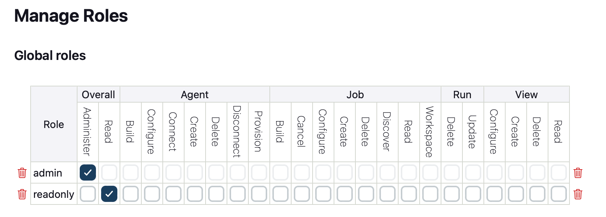
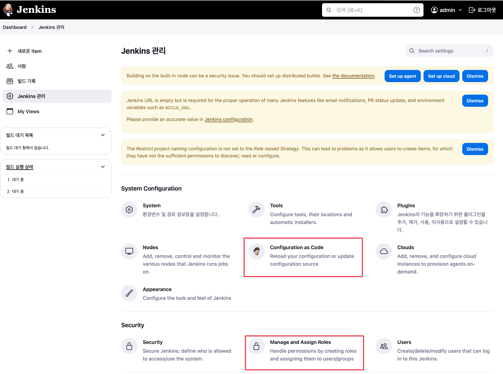
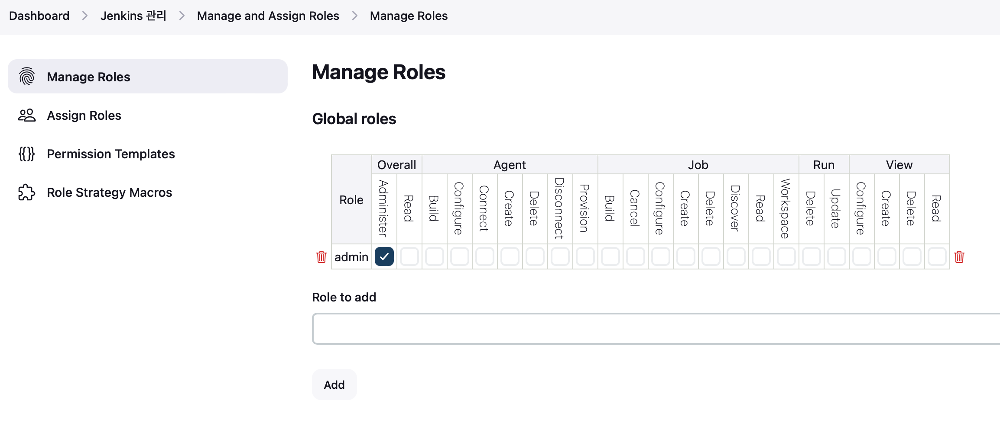
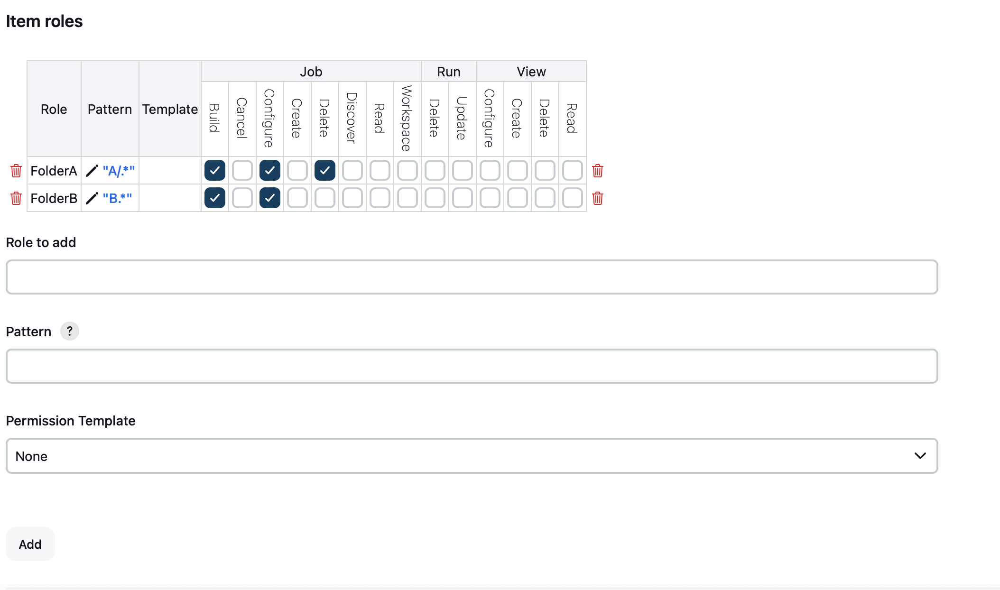
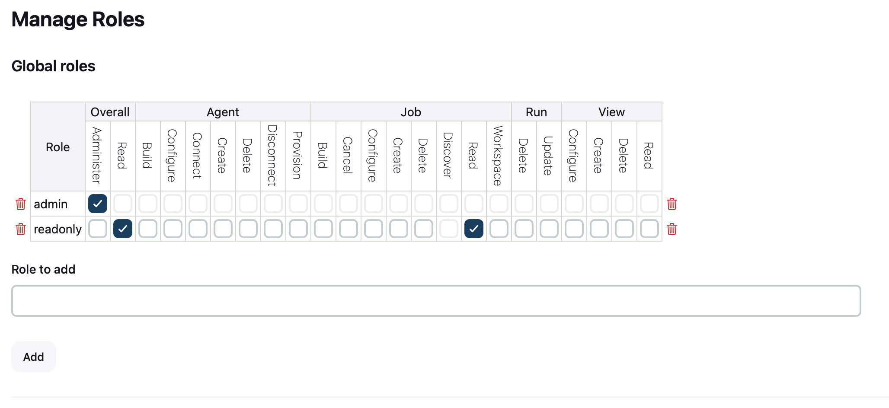

# Jenkins Configuration as Code 플러그인을 사용하여 사용자 정의 구성이 적용된 Jenkins Docker 서비스 배포하기

{: .no_toc }

## 목차
{: .no_toc .text-delta }

1. TOC
{:toc}

---
## 글을 쓴 배경

단순한 Jenkins 배포가 아닌 유저 프로비저닝 등 다양한 젠킨슨 설정을 자동으로 구성할 필요성을 느끼게 되었습니다.

## 글 요약

**사용된 플러그인**

- **Jenkins Configuration as Code**:
- **Role-based-Authorization Strategy**:


**프로세스 요약**

1. userdata를 포함한 ec2 생성 하위는 userdata에 포함된 내용
1. 역할 기반 설정과 관리자 사용자의 자격 증명을 포함하는 jenkins.yml 파일을 생성합니다.
2. 환경 변수 CASC_JENKINS_CONFIG를 설정하여 첫 번째 단계에서 생성한 jenkins.yml 파일을 배치할 위치를 지정합니다.
3. jenkins.yml 파일을 CASC_JENKINS_CONFIG의 위치에 바인드 마운트합니다.
Jenkins 설정을 YAML 파일로 정의함으로써 사용자 지정 젠킨슨 구성을 자동화 합니다.

## 시작하기 전

Jenkins와 AWS에 대한 기본적인 사용 경험을 가진 DevOps 엔지니어를 대상으로 합니다.
Jenkins에 대한 기본적인 이해가 필요합니다.

사용한 레포지토리 주소 Jenkins-repo

https://github.com/jenkinsci/configuration-as-code-plugin/tree/master/demos

## EC2 인스턴스에 사용자 정의 구성내용을 포한한 Jenkins 인스턴스 배포

awscli를 활용한 ec2 배포 부분은 [앞에서 설명한 방식](https://blog.kimkm.com/docs/02_Tech/CICD/Jenkins/jenkins-installation)과 동일합니다.
본 내용에서는 최초 젠킨슨 이미지를 배포할 때 유저 프로비저닝 등 다양한 환경구성을 함께 적용하여 배포하는 방식을 공유합니다.

### awscli를 활용한 EC2 배포
```shell
aws ec2 run-instances \
  --image-id ${UBUNTU_AMI_ID} \
  --count 1 \
  --instance-type t3.large \
  --key-name ${KEY_NAME} \
  --iam-instance-profile Name=${INSTANCE_PROFILE_ROLE} \
  --subnet-id ${SUBNET_ID} \
  --security-group-ids ${JENKINS_SG} \
  --tag-specifications 'ResourceType=instance,Tags=[{Key=Name,Value=jenkins-aws-cli-generate}]' \
  --block-device-mappings 'DeviceName=/dev/sda1,Ebs={VolumeSize=100}' \
  --user-data file://userdata.txt
``` 

### userdata를 이용한 Jenkins 자동배포

### 2.1 userdata.txt

아래 스크립트는 EC2 인스턴스 생성 시 실행되며 Jenkins을 설치하기 위한 환경을 구축합니다.
~ 등으로 구성되었습니다.

```shell
#!/bin/bash

# 사용자 변수 설정
USER_NAME=ubuntu

mkdir -p /home/ubuntu/jenkins/jenkins_home
mkdir -p /home/ubuntu/jenkins/data/init.groovy.d

# 생성된 모든 디렉토리에 대한 권한 설정
chown -R ${USER_NAME}:${USER_NAME} /home/ubuntu/jenkins

# Docker 설치
echo "1. [docker program installation] start"
apt-get update -y
curl -fsSL https://get.docker.com -o get-docker.sh
sh get-docker.sh
usermod -aG docker ${USER_NAME}
newgrp docker

# Docker 서비스 활성화 및 시작
systemctl enable docker
systemctl start docker

apt list docker docker-compose
apt install docker-compose -y

cd ~/jenkins/data

su - ${USER_NAME} -c "cat > ~/jenkins/data/plugins.txt <<EOF
configuration-as-code:1775.v810dc950b_514
role-strategy:713.vb_3837801b_8cc
EOF"

su - ${USER_NAME} -c "cat > ~/jenkins/data/jenkins.yaml <<EOF
jenkins:
  authorizationStrategy:
    roleBased:
      roles:
        global:
          - name: "admin"
            permissions:
              - "Overall/Administer"
            entries:
              - user: "user1"
              - user: "admin"
          - name: "readonly"
            permissions:
              - "Overall/Read"
            entries:
              - group: "authenticated"
              - user: "anonymous"
  securityRealm:
    local:
      allowsSignup: false
      users:
        - id: "admin"
          password: "1234"
        - id: "user1"
          password: "1234"
EOF"

# Dockerfile 생성
su - ${USER_NAME} -c "cat > ~/jenkins/data/Dockerfile <<EOF
FROM jenkins/jenkins:jdk17
USER root
RUN apt-get update -y && apt-get upgrade -y
USER jenkins
COPY ./plugins.txt /usr/share/jenkins/plugins.txt
RUN  jenkins-plugin-cli -f /usr/share/jenkins/plugins.txt
COPY ./jenkins.yaml /usr/share/jenkins/jenkins.yaml
EOF"


# Docker-compose 파일 생성
su - ${USER_NAME} -c "cat > ~/jenkins/data/docker-compose.yml <<EOF
version: '3.9'
services:
  jenkins:
    build: ~/jenkins/data
    container_name: jenkins
    user: jenkins
    environment:
      JAVA_OPTS:
        -Djenkins.install.runSetupWizard=false
        -Dorg.apache.commons.jelly.tags.fmt.timeZone=Asia/Seoul
      CASC_JENKINS_CONFIG: /usr/share/jenkins/jenkins.yaml
    restart: always
    ports:
      - \"80:8080\"
      - \"50000:50000\"
    volumes:
      - /home/ubuntu/jenkins/jenkins_home:/var/jenkins_home
EOF"

su - ${USER_NAME} -c "cd ~/jenkins/data; docker-compose up -d"
```


### 2.2 userdata.txt 상세 설명

**사용자 변수 지정**
* Jenkins과 Docker를 실행할 사용자 이름을 설정합니다.
```bash
USER_NAME=ubuntu
 ```

**Jenkins 디렉토리 생성 및 디렉토리 소유권변경**
```bash
mkdir -p /home/ubuntu/jenkins/jenkins_home
chown -R ubuntu:ubuntu /home/ubuntu/jenkins
 ```

**Docker 설치**
* 공식 Docker 설치 스크립트를 다운받아 실행합니다. 설정한 USER_NAME에 해당하는 사용자를 Docker 그룹에 추가합니다.
* 기본적으로 도커 실행 권한은 root에만 있습니다. ${USER_NAME} 사용자를 Docker 그룹에 추가하여, sudo 없이 Docker 명령을 실행할 수 있도록 합니다.

```bash
echo "1. [docker program installation] start"
apt-get update -y
curl -fsSL https://get.docker.com -o get-docker.sh
sh get-docker.sh
usermod -aG docker ${USER_NAME}
 ```

**Docker 서비스 활성화 및 시작**
```bash
systemctl enable docker
systemctl start docker
```

**Jenkins Docker 컨테이너 실행**
* -d 컨테이너 백그라운드 실행
* -p 8080:8080 젠킨슨은 기본적으로 8080 포트에서 웹 인터페이스를 제공합니다. 호스트 포트를 변경하여 외부에서 Jenkins 웹 인터페이스에 접근하는 포트를 변경할 수 있습니다.
* -p 50000:50000 젠킨슨 에이전트가 실행되기 위한 포트도 컨테이너에 연결해 줍니다.
* --name 컨테이너 이름을 지정합니다.
* -v Jenkins 데이터를 호스트 서버에 마운트하기 위한 설정입니다. Jenkins 설정 및 빌드데이터가 컨테이너 재시작 후에도 유지됩니다.

```bash
# Jenkins Docker 컨테이너 실행
docker run -d -p 8080:8080 -p 50000:50000 \
  --name jenkins \
  -v /home/ubuntu/jenkins/jenkins_home:/var/jenkins_home \
  jenkins/jenkins:jdk17
  ```

**Jenkins 초기 관리자 비밀번호 저장**
* 컨테이너 내부에 있는 var/jenkins_home/secrets 디렉토리내에 있는 비밀번호를 확인합니다.
* 
```shell
echo "Waiting for Jenkins to initialize..."
sleep 30 # Jenkins 초기화를 기다림
docker exec jenkins cat /var/jenkins_home/secrets/initialAdminPassword > /home/ubuntu/jenkins/initialAdminPassword.txt
chown ubuntu:ubuntu /home/ubuntu/jenkins/initialAdminPassword.txt
```

## jenkins 접속하기

http://<호스트의 IP 주소 또는 도메인>:8080 에 접속합니다.

서버에 접속한 후 Administrator password를 확인합니다. /home/ubuntu/jenkins/initialAdminPassword.txt 해당 경로에서 확인 가능합니다.




컨테이너를 배포할 때 확인했던 비밀번호를 입력해줍니다.



install suggested plugins를 클릭하고 젠킨슨을 설치해줍니다.



접속 성공



## FAQ

Q: 설치된 젠킨슨에서 플러그인을 재대로 다운받지 못하면 어떻게 해야 하나요?

A: 보안 그룹 설정에 플러그인을 다운받기위한 HTTP, HTTPS 포트가 열려 있는지 확인합니다.


