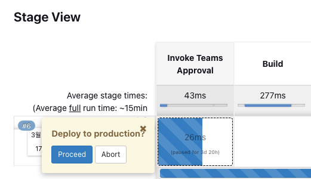

# Microsoft Teams에 Jenkins Pipeline 배포 알림 및 승인 메세지 전송하기
{: .no_toc }

젠킨슨 파이프라인을 통한 자동화된 배포 프로세스에서 관리자의 직접적인 승인이 필요할 때, Microsoft Teams를 통해 알림 및 승인 요청을 구현하는 방법에 대해 소개합니다. 


## 목차
{: .no_toc .text-delta }

1. TOC
{:toc}

---

## 글을 쓴 배경

단순 자동화된 프로세스를 이용하는 것이 아닌 중요한 운영환경 배포 프로세스에서 관리자의 승인이 필요한 경우가 발생하였습니다.

## 글 요약

이 글에서는 Jenkins, Microsoft Teams, 그리고 AWS Lambda를 사용하여 배포 프로세스 중 승인 메커니즘을 구현하는 방법에 대해 설명합니다. 

- **Microsoft Teams**: 알림을 수신할 채널 및 연결 설정 방법
- **AWS Lambda**: Node.js 20x 를 사용하여 Teams 채널로 메세지를 보내는 lambda 함수 구성 방법

## 시작하기 전

Jenkins와 AWS에 대한 사용 경험을 가진 DevOps 엔지니어를 대상으로 합니다. 
AWS Lambda에서 Node.js 20x를 사용하여 Teams 채널로 메시지를 보내는 프로세스에 대한 전반적인 이해가 필요합니다.

참고 문헌 : [Create Incoming Webhooks](https://learn.microsoft.com/en-us/microsoftteams/platform/webhooks-and-connectors/how-to/add-incoming-webhook?tabs=newteams%2Cdotnet#key-features-of-incoming-webhooks)

## 1. Teams 설정

### 1.1 Incoming webhooks 생성

Teams 채널에 콘텐츠를 공유할 수 있게 하기 위해 Incoming Webhooks를 생성합니다. 이 기능을 활용해 Jenkins로부터의 배포 알림 및 승인 요청을 Teams 채널로 직접 보낼 수 있습니다.

1. **Teams에** 접속하여 Incoming Webhook을 생성하고자 하는 채널로 이동합니다.

2. 채널 이름 오른쪽에 있는 '더 보기 옵션 •••'을 선택합니다.


3. **Manage channel**을 선택합니다.


4. **Edit**을 선택한 후, **Incoming Webhook**을 찾아서 구성합니다. 이미 한번 추가하셨다면 Add가 아닌 Configure로 보여지게 됩니다.


5. Webhook에 **Jenkins**라고 이름을 지정하고 **Create**를 클릭합니다.


6. **Done**을 클릭하면 이제 Webhook Url을 받아 사용할 수 있게 됩니다.


### 1.2 Incoming Webhooks 이용 방법

Incoming Webhooks를 통해 Teams 채널에 다음 기능을 포함한 메시지를 보낼 수 있습니다.

* **[Adaptive Cards](https://learn.microsoft.com/en-us/microsoftteams/platform/task-modules-and-cards/what-are-cards#adaptive-cards)**: 복잡한 메시지 콘텐츠를 구성하며, 텍스트, 이미지, 버튼, 입력 필드 등 다양한 컴포넌트를 사용할 수 있습니다.

* **HTTPS 통신**: HTTPS POST 요청을 통해 메시지를 전송합니다.

* **Markdown 지원**: 기본 Markdown 문법을 지원합니다.

* **적용 범위 제한**: 특정 Teams 채널에 대해서만 구성되며, 메시지 전송도 해당 채널로 한정됩니다.

* **리소스 정의 형식**: 메시지는 JSON 형식으로 전송됩니다.

## 2. Lambda 설정

AWS Lambda를 사용하여 Adaptive Card를 활용한 메시지를 Teams 채널로 보내는 함수를 구성합니다. 이 Lambda 함수는 Jenkins로부터 호출되어, Teams에 메시지를 전송하는 역할을 합니다.

## 2.1 Lambda 함수 코드

아래 코드는 Node.js 20x를 사용한 Lambda함수입니다. 

```javascript
import https from 'https';

export const handler = async (event) => {
    console.log("EVENT", event);
    
    const { jobName, jenkinsUrl, buildNumber, startTime, deployExecutor, gitRevision, environment, gitTagName } = event;

    let messageTitle = jobName.substring(jobName.lastIndexOf("-") + 1).charAt(0).toUpperCase() + jobName.substring(jobName.lastIndexOf("-") + 1).slice(1).toLowerCase();

    // 변환된 문자열을 메시지 제목에 포함
    messageTitle = `${messageTitle} API - Jenkins 배포 승인 알림 메세지`;

    // Teams Webhook URL
    const teamsWebhookUrl = process.env.TEAMS_WEBHOOK_URL;

    // Construct the JSON payload for Teams
    const teamsPayload = JSON.stringify(
        {
            "type":"message",
            "attachmentLayout": "list",
            "attachments":[
               {
                 "contentType": "application/vnd.microsoft.card.adaptive",
                 "content": 
                 {
                  "type": "AdaptiveCard",
                  "body": [
                    {
                      "type": "Container",
                      "style": "emphasis",
                      "items": [
                          {
                          "type": "ColumnSet",
                          "columns": [
                              {
                              "type": "Column",
                              "items": [
                                  {
                                  "type": "TextBlock",
                                  "size": "large",
                                  "weight": "bolder",
                                  "text": `${messageTitle}`,
                                  "wrap": true,
                                  "style": "heading"
                                  }
                              ],
                              "width": "stretch"
                              }
                          ]
                          }
                      ],
                      "bleed": true
                      },
                      {
                      "type": "ActionSet",
                      "actions": [
                          {
                          "type": "Action.OpenUrl",          
                          "spacing": "extraLarge",
                          "title": "View Approval Page",
                          "url": `${jenkinsUrl}input/`
                          }
                      ]
                      },
                      {
                          "type": "Container",
                          "items": [
                              {
                              "type": "FactSet",
                              "spacing": "exlarge",
                              "facts": [
                                  {
                                      "title": "Job name",
                                      "value": `${jobName}`
                                  },
                                  {
                                      "title": "Build number",
                                      "value": `${buildNumber}`
                                  },
                                  {
                                      "title": "Start time",
                                      "value": `${startTime}`
                                  },
                                  {
                                      "title": "Triggered by",
                                      "value": `${deployExecutor}`
                                  },
                                  {
                                      "title": "Git Revision",
                                      "value": `${gitRevision}`
                                  },
                                  {
                                      "title": "Environment",
                                      "value": `${environment}`
                                  },
                                  {
                                      "title": "Git Tag Name",
                                      "value": `${gitTagName}`
                                  }
                              ]
                              }
                          ]
                      }
                  ],
                  "$schema": "http://adaptivecards.io/schemas/adaptive-card.json",
                  "version": "1.2",
                  "fallbackText": "This card requires Adaptive Cards v1.5 support to be rendered properly."
                }
                
               }
             ]
           }
    );

    const options = {
        method: 'POST',
        headers: {
            'Content-Type': 'application/json',
            'Content-Length': Buffer.byteLength(teamsPayload),
        }
    };

    // Function to send message to Teams
    const sendMessageToTeams = () => {
        return new Promise((resolve, reject) => {
            const req = https.request(teamsWebhookUrl, options, (res) => {
                let body = '';
                res.on('data', (chunk) => { body += chunk; });
                res.on('end', () => { resolve(body); });
            });

            req.on('error', (error) => {
                reject(error);
            });

            // Send the JSON payload to Teams
            req.write(teamsPayload);
            req.end();
        });
    };

    try {
        const response = await sendMessageToTeams();
        console.log('Response:', response);
        return {
            statusCode: 200,
            body: 'Message sent to Teams successfully'
        };
    } catch (error) {
        console.error('Error:', error);
        return {
            statusCode: 500,
            body: 'Error sending message to Teams'
        };
    }
};
```

## 2.2 Lambda 함수 상세 설명

### 2.2.1 이벤트 데이터 처리
Lambda 함수는 Jenkins로부터 전달받은 custom event 객체에서 변수를 선언하면서, 필요한 정보를 추출합니다. custom event 객체에는 젠킨슨에서 배포와 관련된 상세 정보를 제공합니다. custom event 객체는 젠킨슨 파이프라인 단계에서 정의할 수 있습니다.

```javascript
const { jobName, jenkinsUrl, buildNumber, startTime, deployExecutor, gitRevision, environment, gitTagName } = event;
```

### 2.2.2 메시지 제목 생성
메시지의 제목은 Jenkins 작업 이름(jobName)에서 결정됩니다. 단순하게 문자열로 정의하셔도 무방합니다.

```javascript
let messageTitle = jobName.substring(jobName.lastIndexOf("-") + 1).charAt(0).toUpperCase() + jobName.substring(jobName.lastIndexOf("-") + 1).slice(1).toLowerCase();
messageTitle = `${messageTitle} API - Jenkins 배포 승인 알림 메세지`;
```

### 2.2.3 Teams 메시지 페이로드 구성
배포 정보와 승인 페이지 링크를 포함하는 Adaptive Card 형식의 메시지를 구성합니다.

```javascript
const teamsPayload = JSON.stringify({
    "type": "message",
    "attachmentLayout": "list",
    "attachments": [{
        "contentType": "application/vnd.microsoft.card.adaptive",
        "content": {
            "type": "AdaptiveCard",
            "body": [
                {
                    "type": "Container",
                    "style": "emphasis",
                    "items": [{
                        "type": "ColumnSet",
                        "columns": [{
                            "type": "Column",
                            "items": [{
                                "type": "TextBlock",
                                "size": "large",
                                "weight": "bolder",
                                "text": messageTitle,
                                "wrap": true,
                                "style": "heading"
                            }],
                            "width": "stretch"
                        }]
                    }],
                    "bleed": true
                },
                {
                    "type": "ActionSet",
                    "actions": [{
                        "type": "Action.OpenUrl",
                        "title": "View Approval Page",
                        "url": `${jenkinsUrl}input/`
                    }]
                }
                // FactSet 및 기타 정보 추가
            ],
            "$schema": "http://adaptivecards.io/schemas/adaptive-card.json",
            "version": "1.2",
            "fallbackText": "This card requires Adaptive Cards v1.5 support to be rendered properly."
        }
    }]
});
```

### 2.2.4 메세지 전송
구성된 메세지를 Teams Incoming Webhooks URL로 전송합니다. HTTPS POST 요청을 사용하며, 요청 성공 여부에 따라 응답코드를 반환합니다.

```javascript
const options = {
    method: 'POST',
    headers: {
        'Content-Type': 'application/json',
        'Content-Length': Buffer.byteLength(teamsPayload),
    }
};

const sendMessageToTeams = () => {
    return new Promise((resolve, reject) => {
        const req = https.request(teamsWebhookUrl, options, (res) => {
            let body = '';
            res.on('data', (chunk) => { body += chunk; });
            res.on('end', () => { resolve(body); });
        });

        req.on('error', (error) => {
            reject(error);
        });

        req.write(teamsPayload);
        req.end();
    });
};
```
 

### 2.2.5 응답 처리
메시지 전송 성공 시 "Message sent to Teams successfully"와 상태 코드 200을 반환합니다. 오류 발생 시 오류 메시지와 상태 코드 500을 반환합니다.

```javascript
try {
    const response = await sendMessageToTeams();
    console.log('Response:', response);
    return {
        statusCode: 200,
        body: 'Message sent to Teams successfully'
    };
} catch (error) {
    console.error('Error:', error);
    return {
        statusCode: 500,
        body: 'Error sending message to Teams'
    };
}
```

## 3. Jenkins 구성

Jenkins에서는 배포 알림 메세지를 Teams로 보내기 위해 **Office 365 Connector** 플러그인을 사용할 수도 있고 **Lambda**를 이용해 커스텀한 메세지를 보낼 수 있습니다.

### 3.1 플러그인을 활용하여 파이프라인 알림 메세지 보내기

#### 3.1.1 Office 365 Connector Plugin 설치하기

**메세지를 보낼 스테이지를 구성하기 위한 젠킨슨 잡을 생성합니다. 본 블로그는 pipeline project로 구성하였습니다.**


**젠킨슨 플러그인에서 Office 365 Connector을 설치합니다.**


**젠킨슨 job 구성에 Office 365 Connector이 새롭게 생성되었음을 확인합니다.**


#### 3.1.2 Office 365 Connector 구성하기

**1. Notification webhooks 를 구성합니다.**
* URL - Teams channel 에서 발급받은 Incomming Webhook Url을 넣어줍니다.
* Name - 임의의 이름을 정해줍니다.

**2. 고급 기능을 통해 빌드 상태에 따라 알림 메세지를 전송할 수 있습니다.**


Build status 설명


**3. Advanced Configuration을 구성합니다.**

* **Macros** - 특정 조건이 만족될 때만 알림이 전송되도록 추가적인 조건을 정의합니다.
  * 아래 예시는 checkout 스텝을 실행한 후 `env.GIT_BRANCH` 를 통해 가져온 브랜치 이름이 main인 경우만 알림을 보내겠다는 의미입니다.

  

* **Fact Definitions** - Teams Channel로 보내는 메세지에 사용자 정의 정보를 추가할 수 있습니다. macros 뿐만아니라 Fact Definitons에서도 젠킨슨 파이프라인 내에 정의된 커스텀 변수 혹은 젠킨슨에서 제공해주는 환경변수 모두 사용 가능합니다.
  * 아래 예시는 알림 메시지에 현재 잡 빌드 번호를 추가하고 싶을 때 사용하는 방법입니다.

  * 

* **Timeout** - TCP와 HTTP 연결에 대한 타임아웃을 밀리초 단위로 설정합니다. 기본값은 30000 ( 30초 ) 입니다. 젠킨슨이 알림을 전송하는 데 걸리는 최대 시간을 뜻합니다.


### 3.2 람다를 통해 커스텀 알림 메세지 구성하기

Jenkins 파이프라인에서 커스텀 알림 메시지를 보낼 람다를 호출하는 스크립트를 작성하여 배포 승인 요청을 포함한 다양한 정보를 Teams 채널로 전송할 수 있습니다.

#### 3.2.1 Teams 젠킨슨 파이프라인 파일을 만들어 줍니다.
```groovy
    stage('Invoke Teams Approval') {
    script {

        GIT_COMMIT_ID = sh(returnStdout: true, script: 'git rev-parse --short HEAD').trim()
        // Git 커밋 ID를 가져오는 스크립트
        echo "Git Commit ID => [${GIT_COMMIT_ID}]"

        wrap([$class: 'BuildUser']) {
            def user = env.BUILD_USER_ID
            step([$class                        : 'LambdaInvokeBuildStep',
                  lambdaInvokeBuildStepVariables: [
                          awsRegion             : "${AWS_REGION}",
                          functionName          : "${LAMBDA_FUNCTION_NAME}",
                          synchronous           : true,
                          payload: "{ \"jobName\": \"${env.JOB_NAME}\", \"jenkinsUrl\": \"${env.BUILD_URL}\", \"buildNumber\": \"${env.BUILD_NUMBER}\", \"startTime\": \"${env.BUILD_TIMESTAMP}\", \"deployExecutor\": \"${user}\", \"gitRevision\": \"${GIT_COMMIT_ID}\", \"environment\": \"${ENV_TARGET}\", \"gitTagName\": \"${CONTAINER_IMAGE_TAG}\"}",
                          useInstanceCredentials: true
                  ]
            ])
        }

        def userInput = input(
                id: 'deploy-confirm',
                message: 'Deploy to production?',
                ok: 'Proceed',
                submitter: 'admin',
                parameters: []
        )

    }

}
```

#### 3.2.2 Teams 젠킨슨 파이프라인 코드 상세 설명

##### 3.2.2.1 Git Commit ID 추출

```groovy
GIT_COMMIT_ID = sh(returnStdout: true, script: 'git rev-parse --short HEAD').trim()
echo "Git Commit ID => [${GIT_COMMIT_ID}]"
```
##### 3.2.2.2 사용자 정보 추출

BuildUser 래퍼를 사용하여 현재 Jenkins 빌드를 트리거한 사용자의 ID를 가져옵니다.

```groovy
wrap([$class: 'BuildUser']) {
    def user = env.BUILD_USER_ID
    ...
}
```

##### 3.2.2.3 AWS Lambda 함수 호출

참고자료 : [AWS Lamabda Plugin](https://www.jenkins.io/doc/pipeline/steps/aws-lambda/)

**LambdaInvokeBuildStep** 은 AWS Lambda 함수를 관리하고 호출 할 수 있도록 해주는 플러그인입니다.

그중 invokeLambda 메소드를 사용하여 람다를 호출하고 Lambda에게 전달할 EVENT JSON을 구성하고 전달합니다.

synchronous 옵션을 통해 Lambda 함수를 동기식으로 호출합니다. Lambda 함수의 실행 결과를 기다리고 응답을 반환한 후 다음 단계로 넘어갈 수 있도록 합니다.

```groovy
            wrap([$class: 'BuildUser']) {
                def user = env.BUILD_USER_ID
                step([$class                        : 'LambdaInvokeBuildStep',
                      lambdaInvokeBuildStepVariables: [
                              awsRegion             : "${AWS_REGION}",
                              functionName          : "${LAMBDA_FUNCTION_NAME}",
                              synchronous           : true,
                              payload: "{ \"jobName\": \"${env.JOB_NAME}\", \"jenkinsUrl\": \"${env.BUILD_URL}\", \"buildNumber\": \"${env.BUILD_NUMBER}\", \"startTime\": \"${env.BUILD_TIMESTAMP}\", \"deployExecutor\": \"${user}\", \"gitRevision\": \"${GIT_COMMIT_ID}\", \"environment\": \"${ENV_TARGET}\", \"gitTagName\": \"${CONTAINER_IMAGE_TAG}\"}",
                              useInstanceCredentials: true
                      ]
                ])
            }
```

##### 3.2.2.4 사용자 입력 요청

참고자료 : [Pipeline:Input Step](https://www.jenkins.io/doc/pipeline/steps/pipeline-input-step/)

**input step** 은 Jenkins 파이프라인 실행을 일시 중지하고 사용자의 승인을 기다리게 해주는 플러그인입니다.

사용자 입력을 기다리는 페이지가 호출되고 사용자에게는 "계속" 또는 "중단" 옵션이 보여지게 됩니다.



* id - 파이프라인 내에 여러 input 스텝이 있을경우 명확히 관리할 수 있도록 사용합니다.
* submitter - 이 입력에 응답할 수 있는 사용자 ID와/또는 외부 그룹을 지정합니다.

```groovy
def userInput = input(
        id: 'deploy-confirm',
        message: 'Deploy to production?',
        ok: 'Proceed',
        submitter: 'admin',
        parameters: []
)
```


