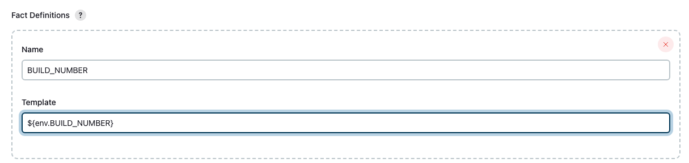

# Microsoft Teams에 Jenkins Pipeline 배포 알림 및 승인 메세지 전송하기
{: .no_toc }

## 목차
{: .no_toc .text-delta }

1. TOC
{:toc}

---

## 글을 쓴 배경

자동화된 배포 프로세스에서 관리자의 직접적인 배포 승인 절차가 필요

## 글 요약

Jenkins과 Microsoft Teams, 그리고 AWS Lambda를 활용하여 배포 프로세스 중 승인 메커니즘을 구현하는 방법을 설명합니다.

- **Microsoft Teams**: 알림을 수신할 채널 및 연결 설정 방법
- **AWS Lambda**: Node.js를 사용하여 Teams 채널로 메세지를 보내는 lambda 함수 구성 방법

## 시작하기 전

본 글은 Jenkins와 AWS에 대한 사용 경험을 가진 DevOps 엔지니어를 대상으로 합니다. 
또한, AWS Lambda를 사용하여 Node.js 코드를 작성하므로 JavaScript에 대한 이해가 필요합니다.

참고 문헌 : [Create Incoming Webhooks](https://learn.microsoft.com/en-us/microsoftteams/platform/webhooks-and-connectors/how-to/add-incoming-webhook?tabs=newteams%2Cdotnet#key-features-of-incoming-webhooks)


## Teams 설정

### Incoming webhooks 생성

외부 어플리케이션이 팀즈 채널에 콘텐츠를 공유할 수 있도록 합니다. 이를 통해 Jenkins에서 배포 알림 및 승인 요청을 Teams 채널로 직접 보낼 수 있습니다.

#### Incoming Webhooks 설정

Incoming Webhooks는 Teams 채널에 고유한 URL을 제공하며 이 URL을 통해 다음과 같은 기능의 메세지를 보낼 수 있습니다.

1. **[Adaptive Cards](https://learn.microsoft.com/en-us/microsoftteams/platform/task-modules-and-cards/what-are-cards#adaptive-cards)**: Microsoft의 다양한 플랫폼에서 사용할 수 있는 메세지 카드 블록입니다.
2. **Actionable Messaging Support**: 사용자가 메세지를 통해 특정 행동을 할 수 있도록 합니다.
3. **Independent HTTPS Messaging Support**: HTTPS POST 통신 요청을 지원합니다.
4. **Markdown Support**: 메시지 카드의 모든 텍스트 필드에서는 기본 Markdown을 지원합니다. HTML 마크업은 사용할 수 없습니다.
5. **Scoped Configuration**: Incoming Webhook은 채널 수준에서 구성되고 적용 범위를 제한합니다. 특정 채널로 메시지를 보내고자 할 때 유용합니다.
6. **Secure Resource Definitions**: 메시지는 JSON 페이로드 형식으로 포맷되며, 이러한 선언적 메시징 구조는 악성 코드의 삽입을 방지합니다.

#### Incoming Webhooks 생성하기

1. Teams에 접속하여 Incoming Webhook을 생성하고자 하는 채널로 이동합니다.
2. 채널 옵션 관리: 채널 이름 오른쪽에 있는 '더 보기 옵션 •••'을 선택합니다.

3. Manage channel을 선택합니다.

4. Edit 을 클릭합니다.

5. Incoming Webhook을 선택하고 구성합니다. 이미 한번 추가하셨다면 Add가 아닌 Configure로 보여지게 됩니다.


6. Jenkins이라고 이름짓고 Create를 클릭합니다.

7. Done을 클릭하면 이제 Webhook Url을 사용할 수 있습니다.


## Jenkins 설정

### 단순 파이프라인 알림 메세지 보내기
**Office 365 Connector Plugin 설치하기**
1. 메세지를 보낼 스테이지를 구성하기 위한 젠킨슨 잡을 생성합니다. 본 블로그는 pipeline project로 구성하였습니다.

2. 젠킨슨 플러그인에서 Office 365 Connector을 설치합니다.

3. 젠킨슨 job 구성에 Office 365 Connector이 새롭게 생성되었음을 확인합니다.


**Office 365 Connector 구성하기**
1. Notification webhooks 를 구성합니다. 
    * URL - Teams channel 에서 발급받은 Incomming Webhook Url을 넣어줍니다.
    * Name - 임의의 이름을 정해줍니다.
2. 고급 기능을 통해 빌드 상태에 따라 알림 메세지를 전송할 수 있습니다.


Build status 설명


3. Advanced Configuration을 구성합니다.
* **Macros** - 특정 조건이 만족될 때만 알림이 전송되도록 추가적인 조건을 정의합니다.
  * 아래 예시는 checkout 스텝을 실행한 후 `env.GIT_BRANCH` 를 통해 가져온 브랜치 이름이 main인 경우만 알림을 보내겠다는 의미입니다.
  
* **Fact Definitions** - Teams Channel로 보내는 메세지에 사용자 정의 정보를 추가할 수 있습니다. macros 뿐만아니라 Fact Definitons에서도 젠킨슨 파이프라인 내에 정의된 커스텀 변수 혹은 젠킨슨에서 제공해주는 환경변수 모두 사용 가능합니다.
  * 아래 예시는 알림 메시지에 현재 잡 빌드 번호를 추가하고 싶을 때 사용하는 방법입니다.
  * 
* **Timeout** - TCP와 HTTP 연결에 대한 타임아웃을 밀리초 단위로 설정합니다. 기본값은 30000 ( 30초 ) 입니다. 젠킨슨이 알림을 전송하는 데 걸리는 최대 시간을 뜻합니다. 


**젠킨슨 파이프라인 구성하여 테스트 해보기**
1. Teams 젠킨슨 파이프라인 파일을 만들어 줍니다.
```groovy
node {
    checkout scm
    stage('Invoke Teams Approval') {
        script {
            def userInput = input(
                    id: 'deploy-confirm',
                    message: 'Deploy to production?',
                    ok: 'Proceed',
                    submitter: 'admin',
                    parameters: []
            )

        }

    }
    stage("Test") {
        // Jenkins 빌드 번호
        echo "Jenkins Build Number => [${env.BUILD_NUMBER}]"
        
    }
}
```


