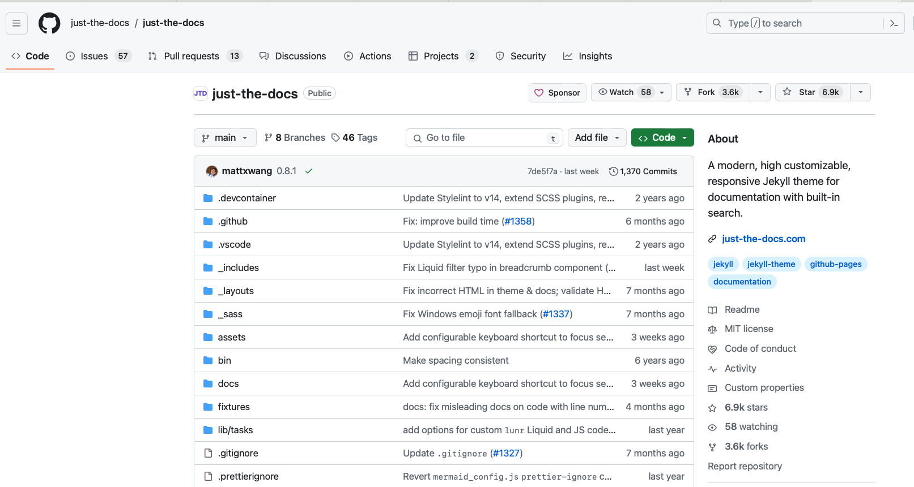
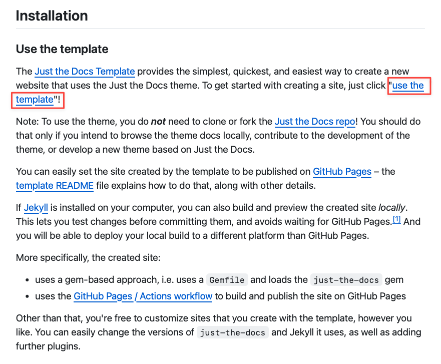
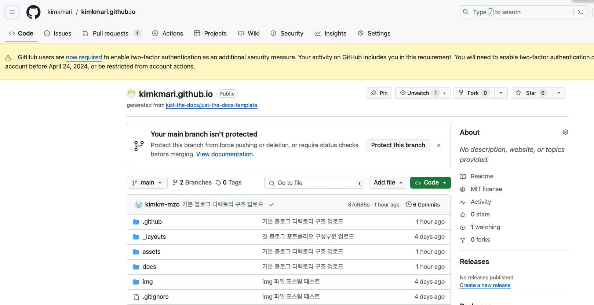
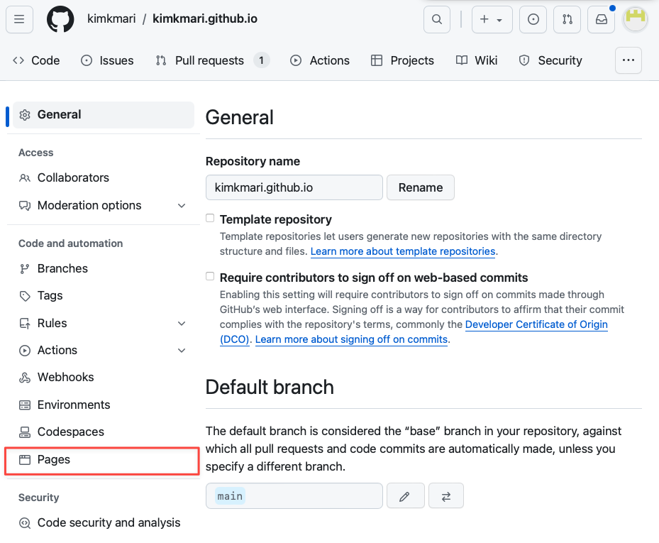
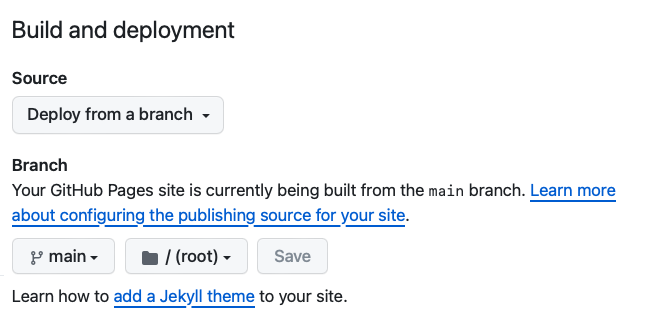
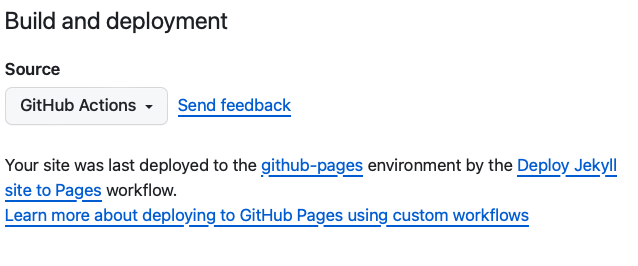
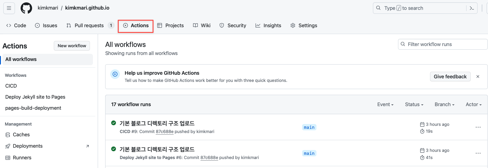
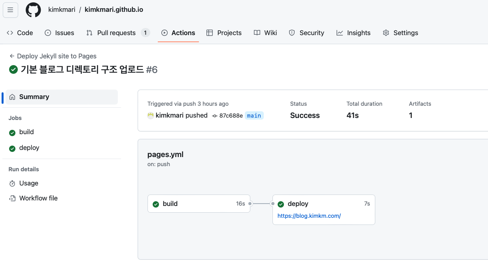
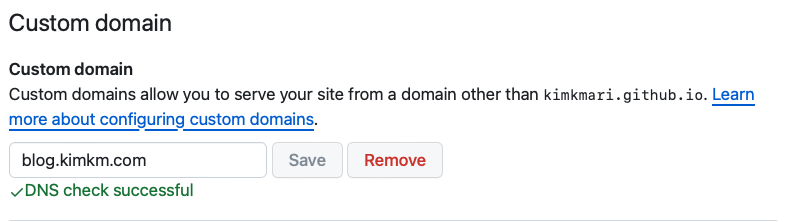

# 도커 이미지를 이용하여 나만의 깃 블로그 만들기
{: .no_toc }

## Table of contents
{: .no_toc .text-delta }

1. TOC
{:toc}

---

## 글을 쓴 배경

기술적 지식과 경험을 공유하기 위해 테크 블로그를 시작하기로 결심했습니다.
여러 블로그 플랫폼을 고려한 끝에 git blog를 선택하여 관련 경험을 공유하고자 합니다.

## 글 요약

- **Jekyll과 Git을 활용한 블로그 배포:** Jekyll을 이용한 정적 웹페이지 생성과 Git을 통한 배포 과정 전반을 설명합니다.
- **로컬 검증 방법:** 도커를 사용해 로컬 환경에서 블로그를 우선 검증하는 방법을 공유합니다. window 유저도 ubuntu 설치 없이 jekyll을 사용할 수 있습니다.
- **Just the Docs 테마 사용법:** 제가 gitblog를 만들 때 선택한 [Just the Docs](https://github.com/just-the-docs/just-the-docs.git) 테마를 적용하는 방법을 안내합니다.
- **Markdown으로 글 작성하기:** 블로그 작성을 위한 Markdown 사용법을 공유합니다.
- **테크블로그 아키텍처 공유:** 제가 구축한 테크 블로그의 구조를 소개하며, 블로그를 처음 시작하여 막막한 분들에게 작은 참고방향을 제안합니다.

## 시작하기 전

이 블로그는 Git과 docker를 간단하게라도 사용할 줄 아는 사람을 대상으로 합니다.
gitHub Pages를 만드는데 필요한 Jekyll은 Windows에서 공식적으로 지원되지 않습니다.
자세한 내용은 Jekyll 설명서의 [“Windows의 Jekyll”](https://jekyllrb.com/docs/installation/windows/)을 참조하세요.

참고 페이지
https://docs.github.com/ko/pages/quickstart

사용된 리소스 
1. git
2. docker

## Git Theme 선정

### 선택한 Theme: Just the Docs
https://github.com/just-the-docs/just-the-docs.git

### 추천 테마
1. https://github.com/artemsheludko/flexible-jekyll.git
2. https://github.com/just-the-docs/just-the-docs.git
3. https://github.com/rosario/kasper.git
4. https://github.com/poole/lanyon.git
5. https://github.com/StartBootstrap/startbootstrap-clean-blog-jekyll.git
6. https://github.com/sylhare/Type-on-Strap.git

## 테마 사용법 (Just the Docs 기준)

### Just the Docs 템플릿 사용하기
1. 레포지토리 생성
   * [Just the Docs Repository](https://github.com/just-the-docs/just-the-docs.git)로 이동하여 README.md 를 확인합니다.
     

  * READMD.md의 Installation.Use the template 섹션의 ["use the template"](https://github.com/new?template_name=just-the-docs-template&template_owner=just-the-docs)을 클릭합니다.
    

  * 이름을 설정하고 레포지토리를 만들어줍니다. 레포지토리 이름은 username.github.io 의 형식으로 만들어 줍니다
    

2. 레포지토리를 웹사이트로 변환하기 ( GitHub Pages를 활성화 하기 )
   * GitHub Pages - GitHub에서 제공하는 무료 웹 호스팅 서비스입니다. GitHub 레포지토리를 사용하여 웹사이트를 손쉽게 배포할 수 있도록 해줍니다. [정적 사이트 생성기인 Jekyll 과의 통합을 공식문서에서는 권장하고있습니다.](https://docs.github.com/ko/pages/setting-up-a-github-pages-site-with-jekyll/about-github-pages-and-jekyll#about-jekyll)
   * Jekyll - 정적 웹 사이트를 자동으로 빌드하고 배포할 수 있도록 해주는 ruby base 라이브러리입니다. Jekyll은 레포지토리의 Markdown 파일들을 HTML로 변환하고, 사이트의 구조를 정의한 템플릿에 따라 최종적인 웹 페이지를 생성합니다.

3. GitHub Pages 사이트 활성화 하기

    * [GitHub Docs 웹사이트 만들기](https://docs.github.com/ko/pages/quickstart#creating-your-website)
   
   * Settings에 있는 Pages 클릭
     
   
   * Pages 페이지에 있는 Build and deployment 선택하기 ( [Configuring a publishing source for your GitHub Pages site](https://docs.github.com/en/pages/getting-started-with-github-pages/configuring-a-publishing-source-for-your-github-pages-site) )
     1. Deploy from a branch - 특정 브랜치(예: main)에 push 이벤트가 발생할 때 자동으로 GitHub Pages 사이트가 빌드되고 배포됩니다.
        브랜치와 폴더(/ 루트 또는 /docs 폴더)를 지정하여, 해당 브랜치의 특정 폴더에서 사이트가 배포될 수 있도록 설정할 수 있습니다.
        
        
        * 장점 - 설정이 간단. jekyll 기반 사이트를 빠르게 시작할 수 있다.
        * 단점 - jekyll 외의 다른 빌드 프로세스나 커스텀 빌드 스크립트를 사용하려면 적합하지 않음. 빌드과정에서 생성된 사이트를 서버에 배포할 때 사용되는 실제 파일들이 동일한 브랜치에 저장되게 됩니다.

     2. GitHub Actions - 사용자는 GitHub Actions을 작성하여 사이트를 빌드하고 배포하는 과정을 완전 제어할 수 있습니다.
        

        * 장점 - Jekyll 외의 빌드 도구를 사용하거나, 복잡한 빌드 및 배포 프로세스를 구성할 수 있는 유연성 제공
        * 단점 - Github Actions에 대한 이해 필요

   * 본 블로그에서는 Github Actions를 선택합니다.
     just-the-docs template을 이용해 레포지토리를 생성했다면 이미 .github 디렉토리안에 github workflow 설정이 되어있습니다.
     따라서 추후 커스터마이징을 고려해 GitHub Actions를 선택하였습니다.
     main 브랜치에 push동작이 일어나면 빌드와 배포작업이 실행됩니다. 해당 내용은 github repository의 Actions부분에서 확인할 수 있습니다.
      
      
   
   * Custom domain 을 가지고 계신게 있다면 입력해줍니다.
      
   
4. 배포 내용 확인하기

구체적인 설명
젬 파일을 사용하여 젬 파일을 사용하고 바로 사용할 수 있는 젬을 로드합니다
GitHub Pages / Actions 워크플로우를 사용하여 사이트를 구축하고 GitHub Pages에 게시합니다
커스터마이징이 간편한 가벼운 버전의 just-the-docs 테마를 여러분의 git repository에 생성완료하였습니다.

2.

2. `Just the Docs` 테마를 포함한 Jekyll 사이트를 로컬에서 구축합니다.
3. 사이트를 로컬에서 빌드하고 테스트합니다.
4. 모든 것이 정상적으로 작동한다면, GitHub에 push하여 변경 사항을 반영합니다.

## 깃 사이트 배포

- **Repository Name 변경**: `<username>.github.io` 형태로 저장소 이름을 변경하여 GitHub Pages를 통해 블로그를 호스팅할 수 있습니다.
- **개인 도메인 사용**: GitHub 저장소 설정에서 개인 도메인을 설정하여 블로그에 사용할 수 있습니다.

## 추가할 만한 섹션

### SEO 최적화

SEO(검색 엔진 최적화)는 블로그의 가시성을 높이는 중요한 요소입니다. `Just the Docs`와 같은 테마는 기본적인 SEO 지원을 제공하지만, 개인적으로 메타 태그, 사이트맵 생성, 적절한 헤더 태그 사용 등을 통해 SEO를 개선할 수 있습니다.

### 콘텐츠 전략

효과적인 블로그를 운영하기 위해서는 명확한 콘텐츠 전략이 필요합니다. 대상 독자를 정의하고,

