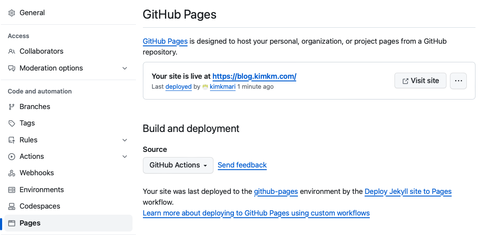
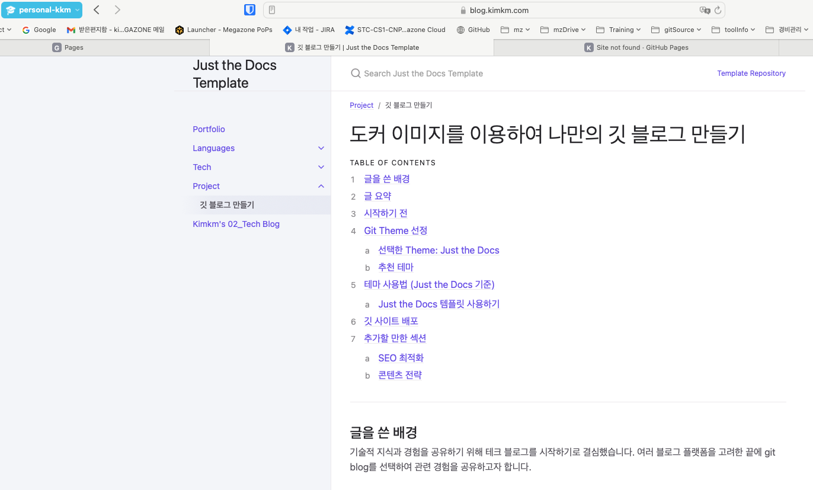
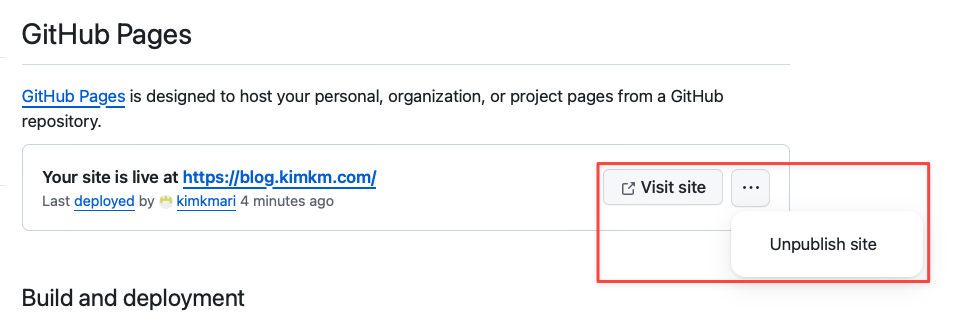

# 나만의 깃 블로그 만들고 도커 이미지로 로컬 테스트 해보기
{: .no_toc }

## 목차
{: .no_toc .text-delta }

1. TOC
{:toc}

---

## 글을 쓴 배경

Tech 경험을 공유하기 위해 블로그를 작성하기로 하였습니다.

여러 블로그 플랫폼을 고민한 끝에 git blog를 선택하여 관련 경험을 공유하고자 합니다.

## 글 요약

- **Jekyll과 Git을 활용한 블로그 배포:** Jekyll을 이용한 정적 웹페이지 생성과 Git을 통한 배포 과정을 설명합니다.
- **Just the Docs 테마 사용법:** 깃 블로그 제작시 선택한 [Just the Docs](https://github.com/just-the-docs/just-the-docs.git) 테마 적용 방법을 안내합니다.
- **로컬 검증 방법:** 도커를 활용하여 쉽게 로컬 환경에서 Jekyll 기반의 블로그를 검증하고 실행할 수 있는 방법을 공유합니다.
- **Markdown으로 글 작성하기:** 블로그 글 작성을 위한 Markdown 사용 법을 공유합니다.
- **테크블로그 구조 공유:** 제가 구축한 테크 블로그의 구조를 소개하고, 블로그 시작이 막막한 분들을 위한 참고 방향을 제시합니다.

## 시작하기 전

이 블로그는 Git과 docker를 간단하게라도 사용할 줄 아는 사람을 대상으로 합니다.
[gitHub Pages를 만드는데 필요한 Jekyll은 Windows에서 공식적으로 지원되지 않습니다.](https://jekyllrb-ko.github.io/docs/installation/windows/)

참고 페이지: [GitHub Pages 공식 문서](https://docs.github.com/ko/pages/quickstart)

사용된 리소스: Git, Docker

## Git Theme 선정

### 선택한 Theme: Just the Docs
- Just the Docs: [GitHub Repository](https://github.com/just-the-docs/just-the-docs.git)

### 추천 테마
1. [Flexible Jekyll](https://github.com/artemsheludko/flexible-jekyll.git)
2. [Just the Docs](https://github.com/just-the-docs/just-the-docs.git)
3. [Kasper](https://github.com/rosario/kasper.git)
4. [Lanyon](https://github.com/poole/lanyon.git)
5. [Clean Blog](https://github.com/StartBootstrap/startbootstrap-clean-blog-jekyll.git)
6. [Type on Strap](https://github.com/sylhare/Type-on-Strap.git)

## 테마 사용법 (Just the Docs 기준)

### Just the Docs 템플릿 사용하기

1. **레포지토리 생성**
    - Just the Docs [GitHub Repository](https://github.com/just-the-docs/just-the-docs.git)의 README.md의 ["use the template"](https://github.com/new?template_name=just-the-docs-template&template_owner=just-the-docs) 링크를 클릭합니다.
    - 원하는 이름을 설정하고 레포지토리를 생성합니다. `username.github.io` 형식을 사용해야합니다.     
    

    

    

2. **레포지토리를 웹사이트로 변환하기 (GitHub Pages 활성화)**
    - GitHub Pages는 무료 웹 호스팅 서비스로, Jekyll과의 통합을 공식적으로 지원합니다. [Jekyll 정보](https://docs.github.com/ko/pages/setting-up-a-github-pages-site-with-jekyll/about-github-pages-and-jekyll#about-jekyll)
    - Jekyll은 정적 웹 사이트를 자동으로 빌드하고 배포하는 Ruby 기반 라이브러리입니다. 레포지토리의 Markdown 파일들을 HTML로 변환하여 최종 웹 페이지를 생성합니다.

3. **GitHub Pages 사이트 활성화하기**
   - [GitHub Docs 웹사이트 만들기 Docs](https://docs.github.com/ko/pages/quickstart#creating-your-website)
   
   - Settings에 있는 Pages 클릭
     
   
   - Pages 섹션에 있는 Build and deployment 선택하기 ( [Configuring a publishing source for your GitHub Pages site](https://docs.github.com/en/pages/getting-started-with-github-pages/configuring-a-publishing-source-for-your-github-pages-site) )
     * **Deploy from a branch** - 특정 브랜치(예: main)에 push 이벤트가 발생할 때 자동으로 GitHub Pages 사이트가 빌드되고 배포됩니다.
        브랜치와 폴더(/ 루트 또는 /docs 폴더)를 지정하여, 해당 브랜치의 특정 폴더에서 사이트가 배포될 수 있도록 설정할 수 있습니다.
        
        
        * 장점 - 설정이 간단. jekyll 기반 사이트를 빠르게 시작할 수 있다.
        * 단점 - jekyll 외의 다른 빌드 프로세스나 커스텀 빌드 스크립트를 사용하려면 적합하지 않음. 빌드과정에서 생성된 사이트를 서버에 배포할 때 사용되는 실제 파일들이 동일한 브랜치에 저장되게 됩니다.

     * **GitHub Actions** - 사용자는 GitHub Actions을 작성하여 사이트를 빌드하고 배포하는 과정을 완전 제어할 수 있습니다.
        

        * 장점 - Jekyll 외의 빌드 도구를 사용하거나, 복잡한 빌드 및 배포 프로세스를 구성할 수 있는 유연성 제공
        * 단점 - Github Actions에 대한 이해 필요

   - 본 블로그에서는 Github Actions를 선택합니다.
     * just-the-docs template을 이용해 레포지토리를 생성했다면 이미 github workflow 설정이 되어있습니다.
     * 추후 커스터마이징을 고려해 GitHub Actions를 선택하였습니다.
     * main 브랜치에 push event 가 발생하면 빌드와 배포작업이 실행됩니다. 해당 내용은 github repository의 Actions부분에서 확인할 수 있습니다.
      
      
   
   - Custom domain이 있다면 입력해줍니다.
      

4. **배포 내용 확인하기**
    - Pages 섹션에서 "Visit site"를 클릭하여 배포된 사이트를 확인합니다. 

    
    
   
   - 외부에 내 블로그를 잠시 노출하고 싶지 않다면 Unpublish site 를 클릭합니다. 정지된 웹페이지는 repository 에 push 이벤트 발생 시 다시 publishing 되게 됩니다.
   [GitHub Pages 사이트 게시 취소](https://docs.github.com/ko/pages/getting-started-with-github-pages/unpublishing-a-github-pages-site)
    

