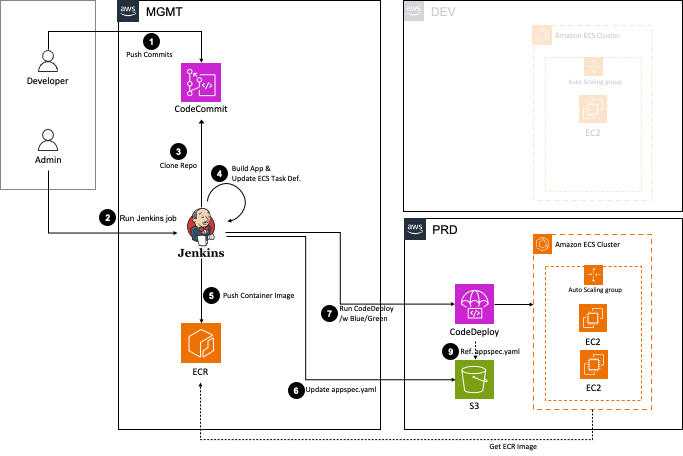

# 젠킨슨 파이프라인을 이용해 ECS Cluster에 Java Application 배포하기
{: .no_toc }

## 목차
{: .no_toc .text-delta }

1. TOC
{:toc}

---

## 글을 쓴 배경

Jenkins 파이프라인을 이용하여 AWS Elastic Container Service Cluster 에 Java Application을 배포하는 과정을 설명하고자 합니다.

## 글 요약

- **전체 아키텍처 설명**

- **주요 리소스 설명**

- **CodeCommit**: AWS가 제공하는 GitHub과 같은 코드 저장소입니다.
- **Jenkins**: 빌드 및 배포 전반을 자동화 할 수 있게 도와주는 오픈소스입니다.
- **ECR**: Amazon Elastic Container Registry는 컨테이너 이미지를 저장하고 관리하는 서비스입니다. Jenkins에서 빌드된 이미지는 이곳에 저장되며, ECS 배포 시 사용됩니다.
- **CodeDeploy**: AWS CodeDeploy는 애플리케이션을 배포하는 서비스입니다. 본 아키텍처에서는 CodeDeploy가 ECR에서 이미지를 가져와 ECS에 어플리케이션을 배포하는 역할을 합니다.
- **ECS**: Amazon Elastic Container Service는 컨테이너를 쉽게 실행하고 관리할 수 있게 해주는 컨테이너 오케스트레이션 서비스입니다.

## 시작하기 전

이 블로그는 Jenkins과 AWS를 어느정도 사용해보신 DevOps를 위한 글 입니다.

Java 어플리케이션을 배포할 예정이기에 Java 개발 지식을 가지고 있어야합니다.

## 1. ECS 클러스터 구축

## 2. Jenkins Pipeline 구축

## 3. ECR 구축

## 4. Jenkins 배포 테스트

